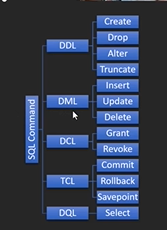
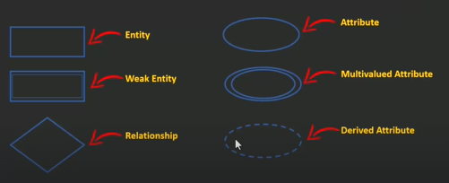

# Started

**In this section will started learn Database**  

## What is Database ?

A database is an organized collection of data so that it can be easily accessed. To mange these databases, Database Management Systems (DBMS) are used.

- Types of DBMS:  
  - Non-Relational (DBMS) : File System, XML..etc.  
  - Relational (RDBMS): enhanced version of DBMS but with relations, examples SQLServer, Oracle, MySQL ..etc.  

In RDBMS Data that is stored in an organized fashion in tables containing rows and columns along with relations between these tables.  

Table/Entity Set Same.  
Row/Entity/Record Same.  
Column/Field/Attribute Same.  

## What is Null?

In a database, "NULL" is a special marker used to indicate that a data value does not exist in the database. It represents a missing or unknown value in a table column.  

When a field or column in a table has a NULL value, it means that the field has no value at all, and it's different from having an empty or zero value.  

Null can be used in several ways, such as indicating missing data, representing optional fields, or as a placeholder for vaules that are not yet known. However, it's essential to use NULL values carefully because they can affect the results of queries and calculations in unexpected ways.  

In summary, NULL is a special vaule in a database that represents the absence of a value in a table column.  

It's used to indicate missing or unknown data and should be used carefully to avoid unexpected results in queries and calculations.  

## Primary Key vs Foreign Key

Primary Key  

- A primary key is a column or set of columns in a relational database table that uniquely identifies each row or record in the table.  

- It is a unique identifier for each record and serves as a reference point for other tables that have a relationship with the table in question.  

- Each table in a relational database must have a primary key, and it should be a non-null value that is unique and stable over time.  

- Primary Key should not be changed.  

Foreign Key  

- A foreign key, on the other hand, is a column or set of columns in a table that refers to the primary key of another table.  

- It establishes a relationship between two tables, allowing data to be shared and linked between them.  

- The foreign key ensures that referential integrity is maintained by ensuring that any value in the foreign key column must exist in the primary key column of the related table.  

## What is Redundancy?

Redundancy refers to the presence of duplicated data within the database.  

Redundancy can occur in different ways, such as storing the same information multiple times, or storing information than can be derived from other data in the database.   

While redundancy can sometimes be useful, it can also cause problems. For example, redundant data takes up additional storage space and can make it more difficult to maintain consistency within the database. If one copy of the data is updated, the other copies may become outdataed, leading to inconsistencies and errors.  

To avoid redundancy in databases, normalization techniques can be used to organize the data in a way that minimizes duplication.  

Duplicates Redundancy :

- More Wasted Space  
- Data Inconsistency  
- Data Corruption  
- Missing/Incomplete Data  
- Data Integrity Problems  
- Hard to maintain  

the solutions for Duplicates redundancy problem using Primary Key and Foreign Key and this is call Normalization.  

Normalization : is the process of organizing data in a database in a way that reduces redundancy and improves data integrity. There are several levels of normalization, also known as normal forms, each with its own set of rules.  

To avoid redundancy in databases, normalization techniques can be used to  organize the data in a way that minimizes duplication.  

This involves breaking down the data into smaller, more atomic pieces and  linking them together through relationships, which can reduce the amount of redundant data and make it easier to manage and update the database.

Additionally, enforcing data constraints, such as unique keys and foreign key relationships, can help prevent redundant data from being inserted into the database. 

## Data Integrity

Data integrity refers to the accuracy, consistency, and reliablity of data over its entire life cycle, from creation to deleteion. In other words, it refers to the assurance that data is complete, accurate, and trustworthy.  

There are several factors that can impact data integrity, including human error, hardware or software failure, security breaches, and data transfer errors.  

To maintain data integrity, it is important to establish appropriate policies and procedures, and to implement appropriate technologies, such as encryption, backups, and access controls.  

There are different types of data integrity that organizations need to consider:  

1. Entity integrity : This ensures that each row or record in a table is unique and can be uniquely identified. This is typically achieved through the use of primary keys.  

2. Referential integrity : This ensures that relationships between tables are maintained and that there are no orphaned records. This is typically achieved through the use of foreign keys.  

3. Domain integrity: This ensures that data is within acceptable ranges or values.  
For Example, a date field should only contain valid dates, and a numeric field should only contain valid numbers.  

4. Business integrity: This ensures that data meets business rules and requirements. For example, a bank might have rules around minmum and maximum account balances, or a hospital might have rules around patient data confidentiality.  

Maintaining data integrity is critical for organizations that rely on accurate and trustworthy data to make informed decisions. Without data integrity, organizations risk making decisions based on incomplete, inaccurate, or unreliable data, which can lead to poor outcomes, financial losses, and damage to reputation.  

## Constraint

In the context of databases, constraints are rules or conditions that are applied to the data to ensure its integrity and consistency. Constraints can be applied to individual columns or to entire tables, and they are used to enforce various rules and restrictions on the data.  

By using constraints, you can help ensure that your data is accurate, consistent, and easy to manage.  

Here are some common types of constraints used in databases:  

1. Primary Key Constraint: This constraint ensures that a column or a set of columns uniquely identifies each row in a table. This constraint helps to enforce data integrity and ensure that there are no duplicate rows in the table.  

2. Foreign Key Constraint: This constraint establishes a relationship between two tables based on a key field. The foreign key constraint ensures that data in one table matches data in another table, and it helps to maintain referential integrity in the database.  

3. Unique Constraint: This constraint ensures that the data in a column or set of columns is unique across all rows in the table. This constraint helps to enforce data integrity and prevent duplicate values from being inserted into the table.  

4. Not Null Constraint: This constraint ensures that a column or set of columns cannot contain null (empty) values. This constraint helps to ensure that the data is complete and accurate, and it can help prevent errors in queries and calculations.  

5. Check Constraint: This constraint ensures that the data in a column or set of columns meets a specified condition. This constraint helps to enforce data integrity and prevent invalid data from being inserted into the table.  

What is the difference between Primary Key Constraint and Unique Constraint ?

Primary Key is Unique but it does not all NULL while Unique allows NULL.  

## What is SQL?

SQL stands for Structured Query Language  

Pronounced as "S-Q-L" or sometimes as "See-Quel"  

SQL is used to communicate with a database  

SQL lets you access and manipulate databases  

Database management systems that use SQL are:  

Oracle, Sybase, Microsoft SQL Server, Access, Ingres, etc.  

Types of SQL Statements : 

- Data Definition Language (DDL)  
- Data Manipulation Language (DML)  
- Data Control Language (DCL)  
- Transaction Control Language (TCL)  
- Data Query Language (DQL)  

  

## DBMs vs RDBMS  

DBMS

- Database Management System.  
- Example : Normal File System, XML..etc.  
- Data Stored In Files no relations, Uses diffrent datastructures.  
- DBMS may or may not have a built-in query language.  
- One user can access data at a time.  
- Small Data, Less Scalable, Backup is hard.  
- less secured  
- No normalization : No data integrity.  
- Or concestancy, more redundancy.  
- Limited Data Sharing.  
- Hard to deal with.  

RDBMS  

- Relational Database Management System.
- Example : MySQL, Oracle, MongoDB, SQL Server...etc.  
- Data stored In Tabular from (Tables and relations between them).  
- Uses a SQL to retrieve data from the database.  
- Multi-users can access data.  
- Larg Data, More Scalable, easy backup.  
- More Secured.  
- Normalization : strong data integrity, consistency, less redundancy.  
- Centralized Data Sharing.  
- Very Easy to deal with.  

## Entity Relationship Diagram (ERD)  

- An Entity Relationship Diagram (ER Diagram) pictorially explains the relationship between entities to be stored in a database.  

- Fundamentally, the ER Diagram is a structural design of the database.  

- It acts as a framework created with specialized symbols for the purpose of defining the relationship between the database entities.  

- ER diagram is created based on three principal components:  

1. Entities.  
2. Attributes.  
3. Relationships.  

- An Entity-Relationship Model represents the structure of the database with the help of a diagram.  

- ER Modelling is a systematic process to design a database as it would require you to analyze all data requirements before implementing your database.  

Why Use ER Diagram in DBMS?  

- ER Diagram helps you conceptualize the database and lets you know which fields need to be embedded for a particular entity.  

- ER Diagram gives a better understanding of the information to be stored in a database.  

- It reduces complexity and allows database designers to build databases quickly.  

- It helps to describe elements using Entity-Relationship models.  

- It allows users to get a preview of the logical structure of the database.  

## ERD Symbols  

Rectangles : This Entity Relationship Diagram symbol represents entity types.  

Ellipses : This symbol represents attributes.  

Diamonds : This symbol represents relationship types.  

Lines : It links attributes to entity types and entity types with other relationship types.  

Primary Key : Here, it underlines the attributes.  

Double Ellipses : Represents multi-valued attributes.  

  

## Components of ERD  

We base an ER Diagram on three basic concepts :  

- Entities
  - Entity (Strong Entity)
  - Weak Entity

- Attributes  
  - Attribute  
  - Key Attribute  
  - Composite Attribute  
  - Multivalued Attribute  
  - Deried Attribute  

- Relationships  
  - One-to-One Relationships  
  - One-to-Many Relationships  
  - Many-to-One Relationships  
  - Many-toMany Relationships  

## Entity (Strong) and Weak Entity  

Entities(Strong Entities)  

- An entity can be either a living or non-living component.  
- It showcases an entity as a rectangle in an ER diagram.  
- Each Entity has a primary key.  
- For example, in a student study course, both the student and the course are entities.  

Weak Entities  

- An entity that makes reliance over another entity is called a weak entity.  
- You showcase the weak entity as a double rectangle in ER Diagram.  
- Weak Entity has no primary key.  
- In the example below, Employee is a strong entity because it has a primary key attribute - ID. Unlike Dependent, the dependent is a weak entity because it does not have any primary key and the name here acts only as a discriminator.  

## Attributes  

Attributes  

- An attribute exhibits the properties of an entity.  
- You can illustrate an attribute with an oval shape in an ER diagram.  

Key Attribute  

- Key attribute uniquely identifies an entity from an entity set.  
- It underlines the text of a key attribute.  
- For example : For a student entity, the ID can uniquely identify a student from a set of students.    

Composite Attribute  

- An attribute that is composed of several other attributes is known as a composite attribute.  
- An oval showcases the composite attribute, and the composite attribute oval is further connected with other ovals.  

Multivalued Attribute  

- Some attributes can possess over one value, those attributes are called multivalued attributes.  
- The double oval shape is used to represent a multivalued attribute.  

Derived Attribute

- An attribute that can be derived from other attributes of the entity is known as a derived attribute.  
- In the ER diagram, the dashed oval represents the derived attribute.  

## Relationships 

Relationship Types :  

- One-to-One Realtionship.  
- One-to-Many Relationship.  
- Many-to-One Relationship.  
- Many-to-Many Relationship.  

## One-to-One Relationship  

When a single element of an entity is associated with a single element of another entity, it is called a one-to-one relationship.  

## One-to-Many/Many-to-One Relationship  

When a single element of an entity is associated with more than one element of another entity, it is called a one-to-many relationship.  

When more than one element of an entity is associated with a single element of another entity, it is called a many-to-one relationship.  

## Many-to-Many Relationship 

 When more than one element of an entity is associated with more than one element of another entity, it is called a Many-to-Many Relationship.  

 ## Cardinality vs Ordinality  

Cardinality : Refers to the maximum number of times an instance in one entity can relate to instances of another entity.  

Ordinality : on the other hand, is the minum number of times an instance in one entity can be associated with an instance in the related entity. (optional/mandatory/required or not).  

