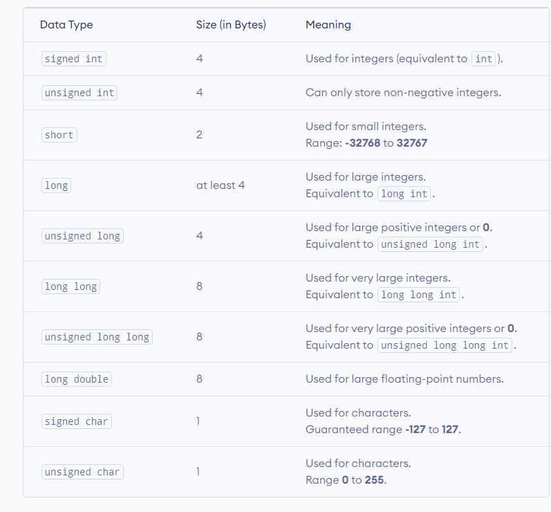
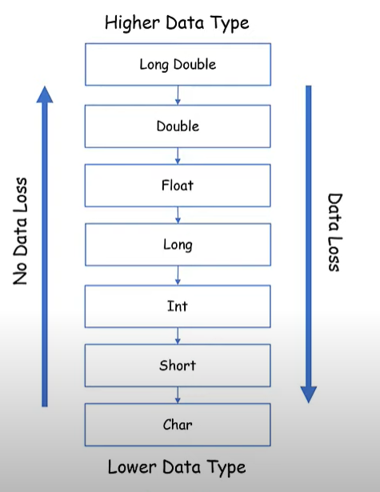

# Started 
**In this section, we will begin to learn and explain the details of the basics of the language C++.**  

## C++ Code Structure  

```cpp
#include <iostream>

int main()

{

std::cout << "Osama Sbeih";

return 0;
}
```
**Output:**
```
Osama Sbeih
```
- `#include` : include the library for me. 

- `#include <iostream>` :include the iostream library for me.  

- `std::cout << "Osama Sbeih";` : The command cout is within the std (standard) namespace, and this command is used to print what we write. It is an abbreviation for "Console out".  

- `int main()` : is a requirement for any C++ program, as it must contain a function named main. It serves as the entry point of the program, and it is the first thing executed when the program is run. Everything between the curly braces {} following main gets executed.  

- `return 0;` : Every function needs a return value, and we will discuss it later.  


## Output (Print)  

**The `cout` object, together with the `<<` operator, is used to output values/print test**
- `std::cout` : Monitor (Destination).  
- `<<` : Write (Verb).  
- `"Message To Be Shown."` : Message (Object).  
- `;` : End (Terminator).  

Example 1 :

```cpp
#include <iostream>

int main()
{
std::cout << "Osama Sbeih";
return 0;
}
```
**Output:**  
```
Osama Sbeih
```
Example 2 : 

```cpp
#include <iostream>

int main()
{
std::cout << "My Name is : Osama Sbeih";
std::cout << " My Age is : 21";
return 0;
}
```
**Output:**  
```
My Name is : Osama Sbeih My Age is : 21
```
Note : To insert a new line, you can use the `\n` character.  

Example 3 :  
```cpp
#include <iostream>

int main()
{
std::cout << "My Name is : Osama Sbeih\n";
std::cout << "My Age is : 21\n";
return 0;
}
```  
**Output:**  
```
My Name is : Osama Sbeih 
My Age is : 21

```

Another way to insert a new line, is with the `std::endl` manipulator.  

Example 4 :
```cpp
#include <iostream>

int main()
{
std::cout << "My Name is : Osama Sbeih" << std::endl;
std::cout << "My Age is : 21" << std::endl;
return 0;
}
```  
**Output:**  
```
My Name is : Osama Sbeih 
My Age is : 21

```

Print Multiple Messages in One Line.  

Example 5 : 
```cpp
#include <iostream>

int main()
{
std::cout << "My Name is : " << "Osama Sbeih" << std::endl;
std::cout << "My Age is : " << "21" << std::endl;
return 0;
}
```  
**Output:**  
```
My Name is : Osama Sbeih 
My Age is : 21

```

## Omitting Namespace

**Using `std::` every time when `cout` and `endl` is annoying, so there is a way to get rid of that and not write it every time.**

```cpp
#include <iostream>
using namespace std;

int main()
{
cout << "My Name is : Osama Sbeih" <<endl;
cout << "My Age is : 21" << endl;
return 0;
}
```  
**Output:**  
```
My Name is : Osama Sbeih 
My Age is : 21

```
`using namespace std;` : allows you to access elements from the C++ standard library without specifying the namespace each time.  


## Which is better \n or endl ?

`\n` :

- It is a simple newline character.
- More lightweight compared to std::endl.
- Doesn't flush the output buffer.


`std::endl` :

- It represents a newline character and also flushes the output buffer. Flushing means forcing the system to immediately write the output to the console or file.
- Useful when you want to ensure that the output is immediately visible, for example, in situations where you need real-time feedback.

**Therefore, each of them has a place to use. If I have a large program that I divide, I use `endl` with some statemnts and other statements `\n`.**

## C++ Comments

- Comments can be used to explain C++ code, and to make it more readable.  
- Comemnts can be single-lined or multi-lined.  

1. Single-lined  
   - Start with two forward slashes (//).   
   - Example 1 :   
 ```cpp
// This is Comments
cout<< "OsamaSbeih" << endl;
```
  - Example 2 :  
```cpp
cout << "OsamaSbeih" << endl; // This is Comments
```
2. Multi-Line Comments  
   - Multi-line comments start with /* and ends with */.  
   - Any test between /* and */ will be ignored by the compiler.  
   - Example :
```cpp
/*This
is
Comments
*/
cout << "Osama Sbeih" << endl;
```

## Literals and Escape Sequences

**Literals : Literals are data used for representing fixed values. They can be used directly in the code.**  

  - Example : `5`, `3.5`, `b` , `"OsamaSbeih"`, ...etc.  
  - You cannot assign different values to these terms.  

Literals Types:  

1. Integer Literals : 
  - `Decimal (base 10)`.  
  - `Octal (Base 8)`.  
  - `Hexadecimal (Base 16)`.  

Note : In C++ programming , `Octal` starts with a `0` , and `Hexadecimal` starts with a `0x`.  

2. Floating-Point Literals: 
  - `13.5`.  
  - `1.99`.  
  - `-8.07`.  

3. Characters Literals: 
  - `A`.  
  - `b`.  
  - `z`.  
  - `$`.  
  - `#`.  
  
4. Escape Sequences Literals:
  - `\n`.  


**Escape Sequences:**

- `\\` (Blackslash)
- `\t` (Tab)
- `\n` (Newline)
- `\"` (Double quote)
- `\'` (Single quote)
- `\a` (Audio bell)


## Variables

**Data Types in C++**
Different types of varaibles (defined with different keywords).  

1. Fundamentals
  - Integral Type 
    - `int`  (Whole Numer : `712`).
    - `char` (Single Character : `A`).
  - Floating Type
    - `float` (Floating Point : `14.5`).
    - `double` (Floating Point : `14.5`).
  - Bolean Type 
    - `bool` (`True` or `False`).
  - String Type
    - `string` (Text:`"Osama"`).
  - Void Type
    - `void` (`Empty`).
  - Wide Character 
    - `wchar_t` (`Unicode`).

2. Derived
  - `Function`.
  - `Array`.
  - `Pointer`.
  - `Refrence`.
3. User-Defined
  - `Class`.
  - `Structure`.
  - `Union`.
  - `Enum`.
  - `Type Def`.

## Declaring (Creating) Variables

To create a varaible, specify the type and assign it a value:  
Syntax:  
```type VaraibleName = value;```  
**Create a variable and assign it**  
Example 1 :  

```cpp
#include <iostream>
using namespace std;

int main()
{
string _MyName = "OsamaSbeih";
cout << "My Name is : " << _MyName <<endl;
return 0;
}
```

**Output**
```
My Name is : OsamaSbeih
```

Example 2 :  

```cpp
#include <iostream>
using namespace std;

int main()
{
int _MyAge = 21;
cout << "My Age is : " << _MyAge;
return 0;
}
```

**Output**  
```
My Age is : 21
```

**You can also declare a variable without assigning the value, and assign the value later**

Example 1 :  

```cpp
#include <iostream>
using namespace std;

int main()
{
string _MyName;
_MyName = "OsamaSbeih";
cout << "My Name is : " << _MyName <<endl;
return 0;
}
```

**Output**
```
My Name is : OsamaSbeih
```

Example 2 :  

```cpp
#include <iostream>
using namespace std;

int main()
{
int _MyAge;
_MyAge = 21;
cout << "My Age is : " << _MyAge;
return 0;
}
```

**Output**  
```
My Age is : 21
```

**If you assign a new value to an existing variable, it will overwrite the previous value**

Example 1 :  

```cpp
#include <iostream>
using namespace std;

int main()
{
string _MyName;
_MyName = "OsamaSbeih";
cout << "My Name is : " << _MyName <<endl;

_MyName = "NeroHero";
cout << "My Name is : " << _MyName <<endl;
return 0;
}
```

**Output**
```
My Name is : OsamaSbeih
My Name is : NeroHero

```

Example 2 :  

```cpp
#include <iostream>
using namespace std;

int main()
{
int _MyAge;
_MyAge = 21;
cout << "My Age is : " << _MyAge;
_MyAge = 30;
cout << "My Age is : " << _MyAge;
return 0;
}
```

**Output**  
```
My Age is : 21
My Age is : 30
```

**All Other Types**

Examples :  

```cpp
#include <iostream>
using namespace std;

int main()
{
string _MyName = "OsamaSbeih";
int _MyAge = 21;
char _MyGender = 'M';
bool _Marrid = false;
double _MySalary = 40.53241;
float _MyGPA = 3.72;

cout << "My Name is : " << _MyName << endl;
cout << "My Age is : " << _MyAge << endl;
cout << "My Gender is : " << _MyGender << endl;
cout << "If I Marrid or No : " << _Marrid << endl;
cout << "My GPA is : " << _MyGPA << endl;
cout << "My Salary is : " << _MySalary << "\n" << endl;
return 0;
}
```

**Output**
```
My Name is : OsamaSbeih
My Age is : 21
My Gender is : M
If I Marrid or No : 0
My GPA is : 3.72
My Salary is : 40.5324
```

Note : 0 Means False , 1 Means True.

**Declare Many Variables**  
To add a variable to another variable, you can use the + operator

Example : 

```cpp
#include <iostream>
using namespace std;

int main()
{
int _Num1 = 10;
int _Num2 = 20;
int _Sum = _Num1 + _Num2;
cout << _Sum;

return;
} 
```

**Output**
```
30
```

**Declare Many Variables**  
To add a variable to another variable, you can use the + operator

Example : 

```cpp
#include <iostream>
using namespace std;

int main()
{
int _Num1 = 10;
int _Num2 = 20;
int _Sum = _Num1 + _Num2;
cout << _Sum;

return;
} 
```

**Output**
```
30
```


**Or**

Example : 

```cpp
#include <iostream>
using namespace std;

int main()
{
int _Num1 = 10;
int _Num2 = 20;
cout << _Num1 + _Num2;

return;
} 
```

## Identifiers Variables

- All C++ variables must be identified with unique names.
- The Identifers is the name of the varaible.
- These unique names are called identifiers
- Identifers can be short names (Like x and y) or more descriptive names (_Age , _Sum , TotalSales).
Note : It is recommended to use descriptive names in order to create understandable and maintainable code.  


## Naming Rules (Rules to name variables)

- Names can contain letters, digits and underscores.  
- Names must begin with a letter or an underscore (_).  
- Names are case sensitive (x and X are different variables)
- Names cannot contain whitespaces or special characters like !,#,%,etc.
- Reserved words (like C++ keywords, such as int) cannot be used as names.


**Example For Correct Identifiers Variables :**
```
int _MyAge;
int MyAge;
int My1Age;
int Age1;
int My_Age;
```

**Example For Wrong Identifiers Variables :**
```
int 1MyAge;
int ^MyAge;
int #MyAge;
int MyAge#;
int 16Age;
```

## Constants in C++

When you do not want others (or yourself) to override existing variable values, use the `const` keyword (this will declare the variable as “constant”, which means `unchangeable` and `read-only`)

**Example:**

```cpp
const int _MyAge = 21; // _MyAge will always be 21
_MyAge = 30; // error : assignment of read-only variable “_MyAge”
```


## User Input

Input Syntax : 

**The `cin` object, together with the `>>` operator, is used to output values/print test**
- `std::cin` : Monitor (Destination).  
- `<<` : Read (Verb).  
- `Variable` : Variable to store input (Object).  
- `;` : End (Terminator).  

**Example 1:**
```cpp
#include <iostream>

int main()

{
string _YouName;
int _YouAge_;

std::cin >> _YouName_;
std::cin >> _YouAge_;

return 0;
}
```
**Output**

```
Osama Sbeih //input from user
21 // input from user
```

**Example 2:**
```cpp
#include <iostream>
using namespace std;
int main()

{
string _YouName;
int _MyAge;
cout << "Please Enter You’r Name : " << endl;
cin >> _YouName;

cout << "Please Enter You’r Age : " << endl;
cin >> _YouAge;

cout << "You’r Name is : " << _YouName << "\n You’r Age is : " << _YouAge << endl;
return 0;
}
```

**Output**

```
Please Enter You’r Name : 
Osama Sbeih //input from user
Please Enter You’r Age : 
21 // input from user
You’r Name is : Osama Sbeih
You’r Age is : 21

```

## Datatypes Sizes & Ranges

  

## Type Modifiers

We can modify some of the fundamental data types by using type modifiers. There are 4 type modifiers in C++.  

1. Signed
2. Unsigned
3. Short
4. Long

We can modify the following data types with the above modifiers  

1. int
2. double
3. char

  

**Example:**

```cpp
#include <iostream>
using namespace std;

int main()
{
int _Varaible1;
signed int _Variable2;
unsigned int _Varaible3;
short int _Varaible4;
unsigned short int _Varaible5;
unsigned short _Variable6
short _Varaible7;
signed long int _Variable8;
long int _Variable9;
long _Variable10;
unsigned long _Variable11;
long long int _Variable12;
unsigned long long _Variable13;
double distance = 56E12; // 56E12 is equal to 56 * 10^12
short d = 3434233; // Error out of range
unsigned int a = -10; // Error! can only store positive number
cout << sizeof(bool);
cout << sizeof(char);
cout << sizeof(short int);
cout << sizeof(float);
cout << sizeof(double);
cout << sizeof(long long);
cout << sizeof(long);
cout << CHAR_MIN << CHAR_MAX << endl;
cout << SHRT_MIN << SHRT_MAX << endl;
cout << LONG_MIN << LONG_MAX << endl;
cout << FLT_MIN << FLT_MAX << endl;
cout << DBL_MIN << DBL_MAX << endl;
cout << INT_MIN << INT_MAX << endl;
cout << USHRT_MIN << USHRT_MAX << endl;
// sizeof(datatypes) this function give you size of datatypes 
// _MIN && _MAX this give you range max and min of datatypes
}
```

## Arithmetic Operators

- `+` Adds two operands
- `-` Substracts second operand from the first
- `*` Multiplies both operands
- `/` Divides numerator by de-numerator
- `%` This gives remainder of an integer division


**Example:**

```cpp
#include <iostream>
using namespace std;

int main()
{

int _Num1 = 10, _Num2 = 20;

cout << "_Num1 + _Num2 = " << _Num1 + _Num2 << endl;
cout << "_Num1 - _Num2 = " << _Num1 - _Num2 << endl;
cout << "_Num1 * _Num2 = " << _Num1 * _Num2 << endl;
cout << "_Num1 / _Num2 = " << _Num1 / _Num2 << endl;
cout << "_Num1 % _Num2 = " << _Num1 % _Num2 << endl;

return 0;
}
```

**Output**

```
_Num1 + _Num2 = 30
_Num1 - _Num2 = -10
_Num1 * _Num2 = 200
_Num1 / _Num2 = 0
_Num1 % _Num2 = 10
```


## Increment Decrement Operators

- `++` (X++ ---> X = X + 1 , ++X ---> X = X + 1)
- `--` (X-- ---> X = X - 1 , --X ---> X = X - 1)

**Example:**
```cpp
#include <iostream>
using namespace std;

int main()
{
int X = 10;
int Y = 20;

X++;
Y--;

cout << "X = " << X << endl;
cout << "Y = " << Y << endl;


return 0;
}
```

**Output**
```
X = 11
Y = 19
```

## Postfix vs Prefix (++A vs A++ , --A vs A--)

- Postfix  
  - `X++` (X will take value , then X will increase by 1)
  - `X--` (X will take value , then X will decrease by 1)

- Prefix  
  - `++X` (X will increase by 1 and become new value)
  - `--X` (X will decrease by 1 and become new value)

**Example:**

```cpp
#include <iostream>
using namespace std;

int main()
{

int X = 10;
int Y = X++; // Y will take the old value of A , then X will increase by 1

cout << " Y = " << Y << endl;
cout << " X = " << X << endl;

Y = ++X; // X will increase by 1 , then Y will take the new value
cout << " Y = " << Y << endl;
cout << " X = " << X << endl;

return 0;
}
```

**Output**
```
Y = 10
X = 11
Y = 12
X = 12

```

## Assignment Operators

- `=` (X=5)
- `+=` (X+=5 equal X = X + 5)
- `-=` (X-=5 equal X = X - 5)
- `*=` (X*=5 equal X = X * 5)
- `/=` (X/=5 equal X = X / 5)
- `%=` (X%=5 equal X = X % 5)

**Example:**

```cpp
#include <iostream>
using namespace std;

int main() 
{
int X = 10 , Y = 20;

X +=Y; // X = X + Y
cout << " X = "  << X << endl;

X -=Y; // X = X - Y
cout << " X = "  << X << endl;

X *=Y; // X = X * Y
cout << " X = "  << X << endl;

X /=Y; // X = X / Y
cout << " X = "  << X << endl;

X %=Y; // X = X % Y
cout << " X = "  << X << endl;

return 0;
}
```

**Output**
```
 X = 30
 X = 10
 X = 200
 X = 10
 X = 10
```

## Relational Operators

- `==` (Checks if the values of two operands are equal or not, if yes then condition becomes true).
- `!=` (Checks if the values of two operands are equal or not, if values are not equal then condition becomes true).
- `> `  (Checks if the value of left operand is greater than the value of right operand, if yes then condition becomes true).
- `< `  (Checks if the value of left operand is less than the value of right operand, if yes then condition becomes true).
- `>=` (Checks if the value of left operand is grater than or equal to the value of right operand, if yes then condition becomes true).
- `<=` (Checks if the value of left operand is less than or equal to the value of right operand, if yes then condition becomes true).


**Example:**
```cpp
#include <iostream>
using namespace std;

int main()
{

int X = 10, Y = 20;

cout << (X == Y) << endl; // 0
cout << (X != Y) << endl; // 1
cout << (X > Y) << endl; // 0
cout << (X < Y) << endl; // 1
cout << (X >= Y) << endl; // 0
cout << (X <= Y) << endl; // 1

return 0;
}
```

**Output**
```
0
1
0
1
0
1
```

Note : Did'nt Forget `1` Means `True` , `0` Means `False`.  

## Logical Operators

- `&&` (Called Logical AND operator. If both the operands are non-zero, then condition becomes true).
- `||` (Called Logical OR Operator. If any of the two operands is non-zero, then condition becomes true).
- `! ` (Called Logical NOT operator. Use to reverse the logical state of its operand. If a condition is true then Logical NOT operator will make false).


**Example:**
```cpp
#include <iostream>
using namespace std;

int main()
{

bool X=1, Y=0;

cout << (X && Y) << endl;
cout << (X || Y) << endl;
cout << !X << endl;
cout << !Y << endl;
cout << !(X && Y) << endl;
cout << !(X || Y) << endl;

return 0;
}
```
**Output**
```
0
1
0
1
1
0
```

## Math Functions

- Squair Root
  - Gives you the root of the number.
**Example:**
```cpp
#include <iostream>
#include <cmath> 

using namespace std;

int main()
{

double X = 64;
cout << sqrt(X) << endl; // 8
cout << sqrt(50) << endl; // 7.07107

return 0;
}
```
**Output**
```
8
7.07107
```

Note : You need to include cmath library to use any function in cmath.  

- Rounding Numbers
  - Round to the nearest integer.
**Example:**
```cpp
#include <iostream>
#include <cmath> 

using namespace std;

int main()
{

cout << round(2.4) << endl; // 2
cout << round(2.5) << endl; // 3
cout << round(2.7) << endl; // 3

cout << sqrt(50) << endl; // 7.07107
cout << round(sqrt(50)) << endl; // 7

return 0;
}
```
**Output**
```
2
3
3
7.07107
7
```

- Power Function
  - Calculate the power of a number

**Example:**
```cpp
#include <iostream>
#include <cmath> 

using namespace std;

int main()
{

int x = 2;
int y = 4;

cout << pow(x,y) << endl; // x^y = 2^4 = 16
cout << pow(4,3) << endl; // 4^3 = 64
return 0;
}
```
**Output**
```
16
64
```

- Ceil & Floor Function
  - Ceil : Celling value of the number passed as the parameter.  
  - Floor : Return integer value that is less than or equal to the argument.  

**Example:**
```cpp
#include <iostream>
#include <cmath> 

using namespace std;

int main()
{

cout << ceil(2.9) << endl; // 3
cout << floor(2.9) << endl; // 2

cout << ceil(-2.9) << endl; // -2
cout << floor(-2.9) << endl; // -3

return 0;
}
```
**Output**
```
3
2
-2
-3
```

- Absolute Function
  - Absolute value of an integer argument n.
**Example:**
```cpp
#include <iostream>
#include <cmath> 

using namespace std;

int main()
{

cout << abs(-10) << endl; // 10
cout << abs(10) << endl; // 10

return 0;
}
```
**Output**
```
10
10
```

There are many you can learn about through the [link](https://en.cppreference.com/w/cpp/header/cmath).

## Structures

- Structures (also called structs) are a way to group several related variables into one place.
- Each variable in the structure is known as a member of the structure.

Syntax :
```
struct NameStructure
{


};

```
How i can called ?  
Syntax  
```
NameStrcutre NameVariable;
```
```cpp
#include <iostream>
using namespace std;

struct Person
{
     string _FirstName;
     string _LastName;
     int _Age;
     string _Email;
     string _Phone;

};

int main()
{

  Person Person1;
  
  Person1._FirstName = "Osama";
  Person1._LastName =  "Sbeih";
  Person1._Age = 21;
  Person1._Email = "Kher3431@gmail.com";
  Person1._Phone = "0787833842";

  cout << Person1._FirstName << " " << Person1._LastName << " " << Person1._Age << " " << Person1._Email << " " << Person1._Phone << "\n";

  return 0;
}
```
**Output**
```
Osama Sbeih 21 kher3431@gmail.com 0787833842
```

*Let's create a simple project. We have 5 people and we want to print their data*  

```cpp
#include <iostream>
using namespace std;

struct Person
{
     string _FirstName;
     string _LastName;
     int _Age;
     string _Email;
     string _Phone;

};

int main()
{

  Person Person1;
  Person Person2;
  Person Person3;
  Person Person4;
  Person Person5;

  Person1._FirstName = "Osama";
  Person1._LastName =  "Sbeih";
  Person1._Age = 21;
  Person1._Email = "Kher3431@gmail.com";
  Person1._Phone = "0787833842";
 
  Person2._FirstName = "Hamza";
  Person2._LastName =  "Sbeih";
  Person2._Age = 17;
  Person2._Email = "HamzaSbeih@gmail.com";
  Person2._Phone = "0777777777";

  Person3._FirstName = "Mohammed";
  Person3._LastName =  "Sbeih";
  Person3._Age = 28;
  Person3._Email = "MohammedSbeih@gmail.com";
  Person3._Phone = "0777777770";

  Person4._FirstName = "Nero";
  Person4._LastName =  "Hero";
  Person4._Age = 21;
  Person4._Email = "NeroHero@gmail.com";
  Person4._Phone = "0787878787";

  Person5._FirstName = "Zero";
  Person5._LastName =  "Hero";
  Person5._Age = 18;
  Person5._Email = "ZeroHero@gmail.com";
  Person5._Phone = "0787878782";
  

  cout << "\nPerson1\n";
  cout << "First Name : " << Person1._FirstName << endl;
  cout << "Last Name : " << Person1._LastName << endl;
  cout << "Age : " << Person1._Age << endl;
  cout << "Email : " << Person1._Email << endl;
  cout << "Phone : " << Person1._Phone << endl;

  cout << "\n******************************\n"; 

  cout << "\nPerson2\n";
  cout << "First Name : " << Person2._FirstName << endl;
  cout << "Last Name : " << Person2._LastName << endl;
  cout << "Age : " << Person2._Age << endl;
  cout << "Email : " << Person2._Email << endl;
  cout << "Phone : " << Person2._Phone << endl;

  cout << "\n******************************\n";

  cout << "\nPerson3\n";
  cout << "First Name : " << Person3._FirstName << endl;
  cout << "Last Name : " << Person3._LastName << endl;
  cout << "Age : " << Person3._Age << endl;
  cout << "Email : " << Person3._Email << endl;
  cout << "Phone : " << Person3._Phone << endl;

  cout << "\n******************************\n";


  cout << "\nPerson4\n";
  cout << "First Name : " << Person4._FirstName << endl;
  cout << "Last Name : " << Person4._LastName << endl;
  cout << "Age : " << Person4._Age << endl;
  cout << "Email : " << Person4._Email << endl;
  cout << "Phone : " << Person4._Phone << endl;

  cout << "\n******************************\n";


  cout << "\nPerson5\n";
  cout << "First Name : " << Person5._FirstName << endl;
  cout << "Last Name : " << Person5._LastName << endl;
  cout << "Age : " << Person5._Age << endl;
  cout << "Email : " << Person5._Email << endl;
  cout << "Phone : " << Person5._Phone << endl;

  cout << "\n******************************\n"; 

  return 0;
}
```
**Output**
```

Person1
First Name : Osama
Last Name : Sbeih
Age : 21
Email : Kher3431@gmail.com
Phone : 0787833842

******************************

Person2
First Name : Hamza
Last Name : Sbeih
Age : 17
Email : HamzaSbeih@gmail.com
Phone : 0777777777

******************************

Person3
First Name : Mohammed
Last Name : Sbeih
Age : 28
Email : MohammedSbeih@gmail.com
Phone : 0777777770

******************************

Person4
First Name : Nero
Last Name : Hero
Age : 21
Email : NeroHero@gmail.com
Phone : 0787878787

******************************

Person5
First Name : Zero
Last Name : Hero
Age : 18
Email : ZeroHero@gmail.com
Phone : 0787878782

******************************
```

## Enum
- An enumeration is a distinct type whose value is restricted to a range of values.  

*Syntax:*
```
enum NameEnum { value1,value2,value3,...etc};
```
How i can Called?  

*Syntax:*
```
NameEnum::ValueEnum
```
**Example:**
```cpp
#include <iostream>
using namespace std;

enum Color {Red, Green, Yellow, Blue};

int main()
{

   Color _MyColor;

   _MyColor = Color::Yellow;
   
   cout << "Color is: " << _MyColor << endl;

  return 0;
}
```
**Output:**
```
2
```

Note1 : `First` Value in Enum return `0` `Second` return `1` `Third` return `2` ... etc.  

Note2 : You can edit value or every value in enum like `First` return `100` and `Second` return `150` ... etc.

**Example:**
```cpp
#include <iostream>
using namespace std;

enum Color {Red=100, Green=150, Yellow, Blue};

int main()
{

   Color _MyColor;

   cout << Color::Red << endl;
   cout << Color::Green << endl;
   cout << Color::Yellow << endl;
   cout << Color::Blue << endl;
  return 0;
}
```
**Output:**
```
100
150
151
152
```

Note : `Yellow` and `Blue` got value 151 and 152 because last value before `Yellow` is 150.  


## Nested Structures and Enums

**Example:**
```cpp
#include <iostream>
using namespace std;

enum enColor {Red, Green, Yellow, Blue};
enum enGender { Male, Female };
enum enMaritalStatus { Single, Married};

struct stAddress
{
   string StreetName;
   string BuildingNo;
   string POBox;
   string ZipCode;
   
};

struct stContactInfo
{
    string Phone;
    string Email;

    stAddress Address;
};

struct stPerson
{

    string FirstName;
    string LastName;
    
    stContactInfo ContactInfo;
    
    enMaritalStatus MaritalStatues;
    enGender Gender;
    enColor FavourateColor;
};

int main()
{

  stPerson Person1;

  Person1.FirstName = "Osama";
  Person1.LastName = "Sbeih";
  
  Person1.ContactInfo.Email = "kher3431@gmail.com";
  Person1.ContactInfo.Phone = "0787833842";
  Person1.ContactInfo.Address.POBox = "1111";
  Person1.ContactInfo.Address.ZipCode = "121212";
  Person1.ContactInfo.Address.StreetName = "Omar Ibn Alkhatab";
  Person1.ContactInfo.Address.BuildingNo = "115";
 
  Person1.Gender = enGender::Male;
  Person1.MaritalStatues = enMaritalStatus::Married;
  Person1.FavourateColor = enColor::Green;
 

  cout << Person1.FirstName << " " << Person1.LastName << endl;

  cout << Person1.ContactInfo.Email << endl;
  cout << Person1.ContactInfo.Phone << endl;
  cout << Person1.ContactInfo.Address.POBox << endl;
  cout << Person1.ContactInfo.Address.ZipCode << endl;
  cout << Person1.ContactInfo.Address.StreetName << endl;
  cout << Person1.ContactInfo.Address.BuildingNo << endl;

  cout << Person1.Gender << endl;
  cout << Person1.MaritalStatues << endl;
  cout << Person1.FavourateColor << endl;

return 0;
}
```
**Output:**
```
Osama Sbeih
kher3431@gmail.com
0787833842
1111
121212
Omar Ibn Alkhatab
115
0
1
1
```

## Casting Data



- Convert Double to Integer

**Example:**
```cpp
#include <iostream>
using namespace std;

int main()
{
int Num1;
double Num2 = 18.99;

Num1 = Num2; // Implicit conversion from double to int

Num1 = (int) Num2; // Explicit Conversion

Num1 = int(Num2); // Explicit Conversion

cout << Num1 << endl;

return 0;
}
```
**Output:**
```
18
```

- Convert String to Int,Float,Double

**Example:**
```cpp
#include <iostream>
#include <string>
using namespace std;

int main()
{
string str = "123.456";

// convert string to Integer
int num_int = stoi(str);

// convert string to float
float num_float = stof(str);

// convert string to double
double num_double = stod(str);

cout << "num_int = " << num_int << endl;
cout << "num_float = " << num_float << endl;
cout << "num_double = " << num_double << endl;
return 0;
}
```
**Output:**
```
num_int = 123
num_float = 123.456
num_double = 123.456
```

Note : Did'nt Forget Include string library.  

- Convert Number to String

**Example:**
```cpp
#include <iostream>
#include <string>
using namespace std;

int main()
{

 int Num1=123;
 double Num2 = 18.99;

 string St1, St2;
 St1 = to_string(Num1);
 St2 = to_string(Num2);

 cout << St1 << endl;
 cout << St2 << endl;

 return 0;
}
```
**Output:**
```
123
18.990000
```

# Strings

- A string variable contains a collection of characters surrounded by double quotes.

- String is Array of Characters.

- The character count inside starts from zero. 

- When two String variables are combined, they are combined and called `Concatenation`

- If I want to combine two String numbers, I first need to convert them to a number and then add them together

**Example:**
```cpp
#include <iostream>
#include <string>

using namespace std;

int main()
{

  string MyString = "ABCDEFGHIJKLMNOPQRSTUVWXYZ"
  cout << "The length of the MyString is: " << MyString.length() << endl;

  cout << MyString[2] << endl; // will print C

  string S1 = "10" , S2 = "20";

  string S3 = S1 + S2;
  cout << S3 << endl; // Will print 1020

  int Sum = stoi(S1) + stoi(S2);
  cout << Sum << endl; // Will print 30

return 0;
}
```

**Output**
```
C
1020
30
```

## Read String With Spaces

- you need to use `getline(cin, NameVariable)`.

**Example:**
```cpp
#include <iostream>
#include <string>

using namespace std;

int main()
{

 string FullName;

 getline(cin, FullName);

 cout << FullName << endl;

return 0;
}
```
**Output**
```
Osama Sbeih // Input From User
Osama Sbeih

```

Note : to solve problem in `getline()` before 1 line write `cin.ignore(1, '\n')` It means ignore the Enter.

## Functions

- A function is a block of code which only runs when it is called.

- You can pass data, known as parameters, into a function.

- Functions are used to perform certain actions, and they are important for reusing code: Define the code once ,and use it many times.

**Example 1:**
```cpp
#include <iostream>
#include <string>

using namespace std;

void myFunction()
{

  cout << "This is my first function, it got executed :-)" << endl;
}


int main()
{


  return 0;
}
```

**Output**
```

```

**Example 2:**
```cpp
#include <iostream>
#include <string>

using namespace std;

void myFunction()
{

  cout << "This is my first function, it got executed :-)" << endl;
}


int main()
{

myFunction();

  return 0;
}
```
**Output**
```
This is my first function, it got executed :-)
```

**Example 3:**
```cpp
#include <iostream>
#include <string>

using namespace std;

void myFunction()
{

  cout << "This is my first function, it got executed :-)" << endl;
}


int main()
{

myFunction();
myFunction();
myFunction();
myFunction();

  return 0;
}
```
**Output**
```
This is my first function, it got executed :-)
This is my first function, it got executed :-)
This is my first function, it got executed :-)
This is my first function, it got executed :-)
```
**Example 4:**
```cpp
#include <iostream>
#include <string>

using namespace std;

void myFunction()
{

  cout << "This is my first function, it got executed :-)" << endl;
}

void myFunction2()
{

  cout << "OsamaSbeih" << endl;
}

int main()
{

myFunction();
myFunction2();
myFunction();
myFunction2();

  return 0;
}
```
**Output**
```
This is my first function, it got executed :-)
Osama Sbeih
This is my first function, it got executed :-)
Osama Sbeih
```

Note1 : Void Function this specifies that the function doesn't return a value.   

Note2 : We can Derived Function return value (String , Integer , Double , Float , Char , Boolean).  

**Example 5:**
```cpp
#include <iostream>
#include <string>

using namespace std;

string myFunction1()
{

return "Hi";
}

int myFunction2()
{

return 10;
}

char myFunction3()
{

return 'N';
}


double myFunction4()
{

return 5.17;
}

int main()
{

int x = myFunction2();

cout << myFunction1() << endl;
cout << x << endl;
cout << myFunction2() << endl;
cout << myFunction3() << endl;
cout << myFunction4() << endl;

return 0;
}
```
**Output**
```
Hi
10
10
N
5.17
```

- Parameters && Arguments :​​ Information can be passed to functions as a parameter. 

**Example 6:**
```cpp
#include <iostream>
#include <string>

using namespace std;


int myFunctionSum(int Num1, int Num2)
{
int Sum = Num1 + Num2;
return Sum;
}


int main()
{
int X, Y;

cout << myFunctionSum(10,20); << endl;

cin >> X;
cin >> Y;

cout << myFunctionSum(X,Y) << endl;

return 0;
}
```
**Output**
```
30
10 // Input from user
20 // Input from user
30
```

## Variable Scope

- Local   
**Example :**
```cpp
#include <iostream>
#include <string>

using namespace std;


void MyFunction1()
{
  int x = 500;

  cout << "The value of x inside function is: " << x << endl;
}


int main()
{
 int x = 10;
 
 cout << "The local value of x inside Main is : " << x << endl;

 MyFunction1();


return 0;
}
```
**Output**
```
The value of x inside function is: 10
The value of x inside function is: 500
```
- Global   
**Example :**
```cpp
#include <iostream>
#include <string>

using namespace std;

int x = 300;


void MyFunction1()
{
  int x = 500;

  cout << "The value of x inside function is: " << x << endl;
}


int main()
{
 int x = 10;
 
 cout << "The local value of x inside Main is : " << x << endl;

 MyFunction1();

 cout << "The Global Value of x is: " << ::x << endl;

return 0;
}
```
**Output**
```
The value of x inside function is: 10
The value of x inside function is: 500
The Global Value of x is: 300
```


