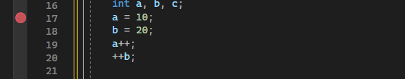
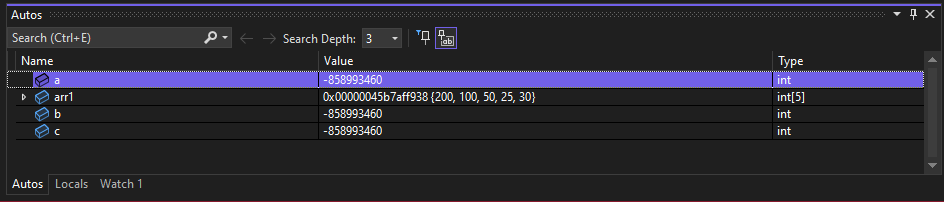
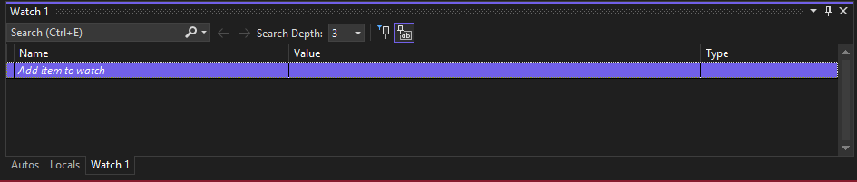

# Started 
**In this section, we will begin to deep learn the details of the basics of the language C++.**  

## Debugging  

**What is Debugging?**  

Debugging is the process of finding and fixing errors or bugs in the source code of any software.  

**Breakpoint & Memory Values**  

This red circle is called BreakPoint  

F11 Step Into --> Executes line by line  
F10 Step Over --> ignores Functions ,.. etc.  
F9  Step Out  --> Skip Functions ,... etc.  
F5  --> Executes from start to breakpoint  

- Autos Window
  

- Quick Watch Window
  

Shift + F9 --> Give you QuickWatch Windows  

## Create Library  

