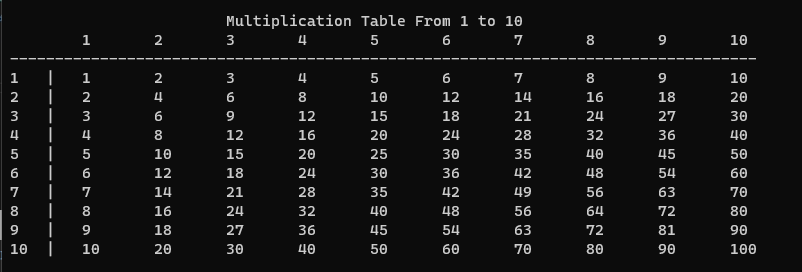

# Started 
**In this section, we will solved 100 problem using C++.**  

## Problem 1
**Write a program to print your name on screen**

```cpp
#include <iostream>
using namespace std;

void PrintName(string Name)
{
	cout << "\nYour Name is : " << Name << endl;
}
int main()
{
	PrintName("OsamaSbeih");
}
```

## Problem 2
**Write a program to ask the user to enter his/her name and print it on screen**    
*The first method*
```cpp
#include <iostream>
using namespace std;

void PrintName(string Name)
{
	cout << "\nYour Name is : " << Name << endl;
}
int main()
{
	string Name;
	cout << "Please Enter You'r Name : \n";
	cin >> Name;
	PrintName(Name);
}
```
*The second method*
```cpp
#include <iostream>
#include <string>

using namespace std;

void PrintName(string Name)
{
	cout << "\nYour Name is : " << Name << endl;
}

string ReadName()
{
	string Name;

	cout << "Please Enter You'r Name : \n";
	getline(cin, Name);

	return Name;
}
int main()
{
	PrintName(ReadName());
}
```

## Problem 3
**Write a program to ask the user to enter a number , then Print "ODD" if its odd, Or "Even" if its even**   
*The first method*
```cpp
#include <iostream>
#include <string>

using namespace std;

string CheckOddEven(int Number)
{
	if (Number % 2 == 0)
		return "Even";

	return "Odd";
}
int main()
{
	int Number;
	cout << "Please Enter Number : " << endl;
	cin >> Number;
	cout << "\nYour Number is : " << CheckOddEven(Number);

    return 0;
}
```
*The Second method*
```cpp
#include <iostream>
#include <string>

using namespace std;

enum enNumberCheck{Odd = 1 , Even = 0};

int ReadNumber() {
	int Num;
	cout << "Please Enter Number : " << endl;
	cin >> Num;
	
	return Num;
}

enNumberCheck CheckNumberType(int Num) {
	int Result = Num % 2;
	if (Result == 0)
		return enNumberCheck::Even;
	return enNumberCheck::Odd;
}

void PrintNumberType(enNumberCheck NumberType) 
{
	if (enNumberCheck::Even == NumberType)
		cout << "\nNumber is Even\n";
	else
		cout << "\nNumber is Odd\n";
}
int main()
{
	PrintNumberType(CheckNumberType(ReadNumber()));
}
```

## Problem 4
**Write a program to ask the user to enter his/her:**  
**1- Age**  
**2- Driver license**  
**Then Print "Hired" if his/her age is grater than 21 and s/he has a driver license, otherwise Print "Rejected"**  

```cpp
#include <iostream>
#include <string>

using namespace std;

struct stInfo {
	int Age;
	bool HasDriveLicense;
};

stInfo ReadInfo()
{
	stInfo Info;
	cout << "Please Enter You'r Age : \n";
	cin >> Info.Age;
	
	cout << "Do you have driver License?" << endl;
	cin >> Info.HasDriveLicense;

	return Info;
}

bool isAccepted(stInfo Info)
{
	return (Info.Age > 21 && Info.HasDriveLicense);
}

void PrintResult(stInfo Info)
{
	if (isAccepted(Info))
		cout << "\nHired\n";
	else
		cout << "\nRejected\n";
}

int main()
{
	PrintResult(ReadInfo());
}
```

## Problem 5
**Write a program to ask the user to enter his/her:**  
**1- Age**  
**2- Driver license**  
**3- Has Recommendation!**  
**Then Print "Hired" if his/her age is grater than 21 and s/he has a driver license, otherwise Print "Rejected" Or Hire him/her without condition.**  

```cpp
#include <iostream>
#include <string>

using namespace std;

struct stInfo {
	int Age;
	bool HasDriveLicense;
	bool HasRecommendation;
};

stInfo ReadInfo()
{
	stInfo Info;
	cout << "Please Enter You'r Age : \n";
	cin >> Info.Age;
	
	cout << "Do you have driver License?" << endl;
	cin >> Info.HasDriveLicense;

	cout << "Do you have Recommendation?" << endl;
	cin >> Info.HasRecommendation;
	return Info;
}

bool isAccepted(stInfo Info)
{
	if (Info.HasRecommendation)
	{
		return true;
	}
		
	return (Info.Age > 21 && Info.HasDriveLicense);
}

void PrintResult(stInfo Info)
{
	if (isAccepted(Info))
		cout << "\nHired\n";
	else
		cout << "\nRejected\n";
}

int main()
{
	PrintResult(ReadInfo());
}
```

## Problem 6
**Write a program to ask the user to enter :**  
**- First Name**  
**- Last Name**  
**Then Print Full Name on screen.**  

```cpp
#include <iostream>
#include <string>

using namespace std;

struct stInfo
{
	string _FirstName;
	string _LastName;
};

string GetFullName(stInfo Info)
{
	return Info._FirstName + " " + Info._LastName;
}
stInfo ReadName()
{
	stInfo FullName;
	cout << "Please Enter First Name : " << endl;
	cin >> FullName._FirstName;

	cout << "Please Enter Last Name : " << endl;
	cin >> FullName._LastName;

	return FullName;

}

void PrintName(string FullName)
{
	cout << "You'r Name is : " << FullName;
}

int main()
{
	PrintName(GetFullName(ReadName()));
}
```

## Problem 7
**Write a program to ask the user to enter:**  
**-Number**  
**Then Print the "Half of the <Number> is <???>".**  

```cpp
#include <iostream>
#include <string>

using namespace std;

int ReadNumber()
{
	int Num;

	cout << "Please Enter The Number : " << endl;
	cin >> Num;

	return Num;
}

float CalculateHalfNumber(int Num) 
{
	return (float) Num / 2;
}

void PrintResult(int Num)
{
	string Result = "Half of " + to_string(Num) + " is " + to_string(CalculateHalfNumber(Num));
	cout << endl << Result;
}
int main()
{
	PrintResult(CalculateHalfNumber(ReadNumber()));
}
```
## Problem 8
**Write a program to ask the user to enter:**  
**-Mark**  
**Then Print the "PASS" if mark >=50 , otherwise print "Fail"**  


*The first method*
```cpp
#include <iostream>
#include <string>

using namespace std;

int ReadMark()
{
	int _Mark;

	cout << "Please Enter You'r Mark : \n";
	cin >> _Mark;

	return _Mark;
}

string CheckMark(int _Mark)
{
	if (_Mark >= 50)
		return "PASS";
	return "Fail";
}

void PrintResults(string Mark)
{
	cout << "You'r Finall Mark is : " << Mark << endl;
}
int main()
{
	PrintResults(CheckMark(ReadMark()));
}
```

*The Second method*
```cpp
#include <iostream>
#include <string>

using namespace std;

enum enPassFail {Pass = 1 , Fail = 2};
int ReadMark()
{
	int _Mark;

	cout << "Please Enter you'r Mark? : \n";
	cin >> _Mark;

	return _Mark;
}

enPassFail CheckMark(int Mark)
{
	if (Mark >= 50)
		return enPassFail::Pass;
	return enPassFail::Fail;
}

void PrintResult(enPassFail Mark)
{
	if (CheckMark(Mark) == enPassFail::Pass)
		cout << "\nPass\n";
	else
		cout << "\nFail\n";
}
int main()
{
	PrintResult(CheckMark(ReadMark()));
}
```

## Problem 9
**Write a program to ask the user to enter:**  
**- Number1, Number2, Number3**  
**Then Print the Sum of entered numbers**  


```cpp
#include <iostream>
#include <string>

using namespace std;

void ReadNumbers(int &Num1, int &Num2, int &Num3)
{
	cout << "Please Enter First Number :\n";
	cin >> Num1;

	cout << "Please Enter Second Number :\n";
	cin >> Num2;

	cout << "Please Enter Third Number :\n";
	cin >> Num3;

}

int Sumof3Numbers(int Num1, int Num2, int Num3)
{ 
	return Num1 + Num2 + Num3;
}

void PrintResults(int Total)
{
	cout << "Summation Three Number is : " << Total << endl;
}
int main()
{
	int Num1, Num2, Num3;
	ReadNumbers(Num1, Num2, Num3);
	PrintResults(Sumof3Numbers(Num1,Num2,Num3));
}
```

## Problem 10
**Write a program to ask the user to enter:**  
**-Mark1, Mark2, Mark3**  
**Then Print the Average of entered Marks**  

```cpp
#include <iostream>
#include <string>

using namespace std;

void ReadNumbers(int &Mark1, int &Mark2, int &Mark3)
{
	cout << "Please Enter First Number :\n";
	cin >> Mark1;

	cout << "Please Enter Second Number :\n";
	cin >> Mark2;

	cout << "Please Enter Third Number :\n";
	cin >> Mark3;

}

int Sumof3Numbers(int Mark1, int Mark2, int Mark3)
{ 
	return Mark1 + Mark2 + Mark3;
}

float CalculateAverage(int Mark1, int Mark2, int Mark3)
{
	return (float)Sumof3Numbers(Mark1, Mark2, Mark3) / 3;
}

void PrintResults(float Average)
{
	cout << "The Average is : " << Average << endl;
}
int main()
{
	int Mark1,	Mark2, Mark3;
	ReadNumbers(Mark1, Mark2, Mark3);
	PrintResults(CalculateAverage(Mark1,Mark2,Mark3));
}
```

## Problem 11
**Write a program to ask the user to enter:**  
**- Mark1,Mark2,Mark3**
**Then Print the Average of entered Marks, and print "Pass" if average>=50, otherwise print "FAIL"**
```cpp
#include <iostream>
#include <string>

using namespace std;

enum enPassFail {Pass = 1 , Fail = 2};
void ReadNumbers(int &Mark1, int &Mark2, int &Mark3)
{
	cout << "Please Enter First Number :\n";
	cin >> Mark1;

	cout << "Please Enter Second Number :\n";
	cin >> Mark2;

	cout << "Please Enter Third Number :\n";
	cin >> Mark3;

}

int Sumof3Numbers(int Mark1, int Mark2, int Mark3)
{ 
	return Mark1 + Mark2 + Mark3;
}

float CalculateAverage(int Mark1, int Mark2, int Mark3)
{
	return (float)Sumof3Numbers(Mark1, Mark2, Mark3) / 3;
}

enPassFail CheckAverage(float Average)
{
	if (Average >= 50)
		return enPassFail::Pass;
	return enPassFail::Fail;
}

void PrintResults(float Average)
{
	cout << "The Average is : " << Average << endl;
	if (CheckAverage(Average) == enPassFail::Pass)
		cout << "\n You Passed";
	else
		cout << "\n You Failed";
}
int main()
{
	int Mark1,	Mark2, Mark3;
	ReadNumbers(Mark1, Mark2, Mark3);
	PrintResults(CalculateAverage(Mark1,Mark2,Mark3));
}
```

## Problem 12
**Write a program to ask the user to enter:**  
**- Number1, Number2**
**Then Print the Max Number**

```cpp
#include <iostream>
#include <string>

using namespace std;

void ReadNumbers(int& Number1, int& Number2)
{
	cout << "\nPlease Enter First Number :\n";
	cin >> Number1;

	cout << "\nPlease Enter Second Number :\n";
	cin >> Number2;

}

int MaxOf2Number(int Number1, int Number2)
{
	if (Number1 > Number2)
		return Number1;
	return Number2;
}

void PrintResults(int Max)
{
	cout << "\n The Maximum Number is : " << Max << endl;
}
int main()
{
	int Number1, Number2;
	ReadNumbers(Number1, Number2);
	PrintResults(MaxOf2Number(Number1, Number2));
}
```

## Problem 13
**Write a program to ask the user to enter 3 Numbers:**  
**- A, B, C**
**Then Print the Max Number**

```cpp
#include <iostream>
#include <string>

using namespace std;

void ReadNumbers(int& Number1, int& Number2, int &Number3)
{
	cout << "\nPlease Enter First Number :\n";
	cin >> Number1;

	cout << "\nPlease Enter Second Number :\n";
	cin >> Number2;

	cout << "\nPlease Enter Third Number :\n";
	cin >> Number3;

}

int MaxOf2Number(int Number1, int Number2)
{
	if (Number1 > Number2)
		return Number1;
	return Number2;
}
int MaxOf3Number(int Number1, int Number2 , int Number3)
{
	if (Number1 > Number2 && Number1 > Number3)
		return Number1;

	else if (Number2>Number1 && Number2 > Number3)
	    return Number2;

	return Number3;

}


void PrintResults(int Max)
{
	cout << "\n The Maximum Number is : " << Max << endl;
}
int main()
{
	int Number1, Number2, Number3;
	ReadNumbers(Number1, Number2, Number3);
	PrintResults(MaxOf3Number(Number1, Number2, Number3));
}
```

## Problem 14
**Write a program to ask the user to enter:**  
**- Number1, Number2**
**Then Print the two numbers , then Swap the two numbers and print them**

```cpp
#include <iostream>
#include <string>

using namespace std;

void ReadNumbers(int& Number1, int& Number2)
{
	cout << "\nPlease Enter First Number :\n";
	cin >> Number1;

	cout << "\nPlease Enter Second Number :\n";
	cin >> Number2;

}

void Swap(int& Number1, int& Number2)
{
	int Temp = Number1;
	Number1 = Number2;
	Number2 = Temp;
}

void PrintNumbers (int Number1 , int Number2)
{
	cout << "Number1 = " << Number1 << endl;
	cout << "Number2 = " << Number2 << endl;
}
int main()
{
	int Number1, Number2, Number3;

	ReadNumbers(Number1, Number2);
	PrintNumbers(Number1,Number2);

	Swap(Number1, Number2);
	PrintNumbers(Number1, Number2);
}
```

## Problem 15
**Write a program to calculate rectangle area and print it on the screen**

```cpp
#include <iostream>
#include <string>

using namespace std;

void ReadNumbers(float& Length, float& Width)
{
	cout << "\nPlease Enter Length of Area :\n";
	cin >> Length;

	cout << "\nPlease Enter Width of Area :\n";
	cin >> Width;

}

float CalculateRectangleArea(float Length, float Width)
{
	return Length * Width;
}

void PrintResults(float Area)
{
	cout << "The Area of Rectangle is : " << Area << endl;
}

int main()
{
	float Length, Width;
	ReadNumbers(Length, Width);
	PrintResults(CalculateRectangleArea(Length, Width));
}
```

## Problem 16
**Write a program to calculate rectangle area through diagonal and side are of rectangle and print it on the screen**  
- Area = A * $\sqrt{D^2-A^2}$  

```cpp
#include <iostream>
#include <string>

using namespace std;

void ReadNumbers(float& A, float& D)
{
	cout << "\nPlease Enter A of Area :\n";
	cin >> A;

	cout << "\nPlease Enter D of Area :\n";
	cin >> D;

}

float CalculateRectangleAreabySideAndDiagonal(float A, float D)
{
	float Area = A * sqrt(pow(D, 2) - pow(A, 2));
	return Area;
}

void PrintResults(float Area)
{
	cout << "The Area of Rectangle by  Side and Diagonal is : " << Area << endl;
}

int main()
{
	float A, D;
	ReadNumbers(A, D);
	PrintResults(CalculateRectangleAreabySideAndDiagonal(A, D));
}
```

## Problem 17
**Write a program to calculate triangle area then print it on the screen**  
<sup>1</sup>&frasl;<sub>2</sub> A * H;

```cpp
#include <iostream>
#include <string>

using namespace std;

void ReadNumbers(float& A, float& H)
{
	cout << "\nPlease Enter A of Area :\n";
	cin >> A;

	cout << "\nPlease Enter H of Area :\n";
	cin >> H;

}

float CalculateTriangleArea(float A, float H)
{
	float Area = 0.5 * A * H;
	return Area;
}

void PrintResults(float Area)
{
	cout << "The Area of Triangle is : " << Area << endl;
}

int main()
{
	float A, H;
	ReadNumbers(A, H);
	PrintResults(CalculateTriangleArea(A, H));
}
```

## Problem 18

**Write a program to calculate circle area then print it on the screen**
- Area = &#960; * $R^2$

```cpp
#include <iostream>
#include <string>
using namespace std;

float ReadRadious()
{
	float R;
	cout << "\nPlease Enter Radious :\n";
	cin >> R;

	return R;
}

float CalculateCricleArea(float R)
{
	const float _PI = 3.141592653589793238;

	float Area = _PI * pow(R,2);

	return Area;
}

void PrintResults(float Area)
{
	cout << "The Area of Circle is : " << Area << endl;
}

int main()
{
	PrintResults(CalculateCricleArea(ReadRadious()));
}
```
## Problem 19

**Write a program to calculate circle area through diameter, then print it on the screen.**
- Area = &#960; * $D^2$ &frasl; <sub>4</sub>

```cpp
#include <iostream>
#include <string>
using namespace std;

float ReadDiameter()
{
	float D;
	cout << "\nPlease Enter Diameter :\n";
	cin >> D;

	return D;
}

float CalculateCirecleAreaByDiameter(float D)
{
	const float _PI = 3.141592653589793238;

	float Area = (_PI * pow(D,2))/4;

	return Area;
}

void PrintResults(float Area)
{
	cout << "The Area of Circle by Diameter is : " << Area << endl;
}

int main()
{
	
	
	PrintResults(CalculateCirecleAreaByDiameter(ReadDiameter()));
}
```

## Problem 20

**Write a program to calculate Circle area inscribed in a square, then print it on the screen.**
- Area =  &#960; * $A^2$ &frasl; 4

```cpp
#include <iostream>
#include <string>
using namespace std;

float ReadSquareSide()
{
	float A;
	cout << "\nPlease Enter Square Side A ? :\n";
	cin >> A;

	return A;
}

float CalculateAreaInscribedInSqaure(float A)
{
	const float _PI = 3.141592653589793238;

	float Area = (_PI * pow(A,2))/4;

	return Area;
}

void PrintResults(float Area)
{
	cout << "The Circle Area = " << Area << endl;
}

int main()
{	
	PrintResults(CalculateAreaInscribedInSqaure(ReadSquareSide()));
}
```

## Problem 21

**Write a program to calculate circle area along the circumferenc, then print it on the screen.**
- Area = $L^2$ &frasl; (4* &#960;)

```cpp
#include <iostream>
#include <string>
using namespace std;

float ReadCricumference()
{
	float L;
	cout << "\nPlease Enter Circumference Side A ? :\n";
	cin >> L;

	return L;
}

float CalculateCircleAreaByCircumference(float L)
{
	const float _PI = 3.141592653589793238;

	float Area = pow(L,2) / (4 * _PI);

	return Area;
}

void PrintResults(float Area)
{
	cout << "The Circle Area  = " << Area << endl;
}

int main()
{	
	PrintResults(CalculateCircleAreaByCircumference(ReadCricumference()));
}
```

## Problem 22

**Write a program to calculate circle area Inscribed in an Isosecles Triangle,then print it on the screen.**   
Area = &#960; * ($b^2$ &frasl; 4) * ($2 * A - B$) &frasl; ($2 * A + B$)

```cpp
#include <iostream>
#include <string>
using namespace std;

void ReadTriangleData(float &A , float &B)
{
	
	cout << "\nPlease Enter triangle side A ? :\n";
	cin >> A;

	cout << "\nPlease Enter triangle base B ? :\n";
	cin >> B;
}

float CalculateAreaByITriangle(float A , float B)
{
	const float _PI = 3.141592653589793238;

	float Area = _PI * (pow(B,2) / 4) * ((2 * A - B)/(2 * A + B));

	return Area;
}

void PrintResults(float Area)
{
	cout << "The Circle Area  = " << Area << endl;
}

int main()
{	
	float A, B;
	ReadTriangleData(A, B);
	PrintResults(CalculateAreaByITriangle(A,B));
}
```

## Problem 23
**Write a program to calculate circle area Inscribed in an Isosceles Triangle,then print it on the screen.**    


$$
\text{Area} = \pi \left( \frac{A \times B \times C}{4 \sqrt{P \times (P-A) \times (P-B) \times (P-C)}} \right)^2
$$


$$
P = \frac{A + B + C}{2}
$$

```cpp
#include <iostream>
#include <string>
using namespace std;

void ReadTriangleData(float &A , float &B, float &C)
{
	
	cout << "\nPlease Enter triangle side A ? :\n";
	cin >> A;

	cout << "\nPlease Enter triangle base B ? :\n";
	cin >> B;

	cout << "\nPlease Enter triangle side C ? :\n";
	cin >> C;
}

float CalculateAreaByATriangle(float A , float B, float C)
{
	const float _PI = 3.141592653589793238;
	float P = (A + B + C) / 2;

	float T;
	T = (A * B * C) / (4 * sqrt(P * (P - A) * (P - B) * (P - C)));

	float Area = _PI * pow(T, 2);

	return Area;
}

void PrintResults(float Area)
{
	cout << "The Circle Area  = " << Area << endl;
}

int main()
{	
	float A, B, C;
	ReadTriangleData(A, B, C);
	PrintResults(CalculateAreaByATriangle(A,B,C));
}
```

## Problem 24

**Write a program to ask the user to enter :**  
**- Age**  
**If age is between 18 and 45 print "Valid Age" otherwise print "Invalid Age"**  

```cpp
#include <iostream>
#include <string>
using namespace std;

int ReadAge()
{
	int _Age;
	cout << "Please Enter You'r Age : \n";
	cin >> _Age;

	return _Age;
}

bool ValidateNumberInRande(int _Age , int From, int To)
{
	return (_Age >= From && _Age <= To);
}

void PrintResults(int _Age)
{
	if (ValidateNumberInRande(_Age, 18, 45))
		cout << " is a Valid Age" << endl;
	else
		cout << " is Invalid Age" << endl;

}

int main()
{	
	PrintResults(ReadAge());
}
```

## Problem 25

**Write a program to ask the user to enter :**  
**- Age**  
**If age is between 18 and 45 print "Valid Age" otherwise print "Invalid Age" and re-ask user to enter a valid age**  
**Note : You shold keep asking user to enter a vlid age until he/she enters it.**  

```cpp
#include <iostream>
#include <string>
using namespace std;

int ReadAge()
{
	int _Age;
	cout << "Please Enter You'r Age : \n";
	cin >> _Age;

	return _Age;
}

bool ValidateNumberInRande(int _Age , int From, int To)
{
	return (_Age >= From && _Age <= To);
}

void PrintResults(int _Age)
{
	if (ValidateNumberInRande(_Age, 18, 45))
		cout << " is a Valid Age" << endl;
	else
		cout << " is Invalid Age" << endl;

}

int ReadUntilAgeBetween(int From, int To)
{
	int _Age = 0;
	do
	{
		_Age = ReadAge();
	} while (!ValidateNumberInRande(_Age, From, To));

	return _Age;
}

int main()
{	
	PrintResults(ReadUntilAgeBetween(18,45));
}
```

## Problem 26

**Write a program to print numbers from 1 to N.**

```cpp
#include <iostream>
#include <string>
using namespace std;

int ReadNumber()
{
	int N;
	cout << "Please Enter Number: \n";
	cin >> N;

	return N;
}

void PrintNumberFrom1ToN(int N)
{
	for (int i = 1; i <= N; i++)
	{
		cout << i << endl;
	}
}

int main()
{	
	PrintNumberFrom1ToN(ReadNumber());
}
```

## Problem 27

**Write a program to print numbers from N to 1.**

```cpp
#include <iostream>
#include <string>
using namespace std;

int ReadNumber()
{
	int N;
	cout << "Please Enter Number : \n";
	cin >> N;

	return N;
}

void PrintNumberFromNTo1(int N)
{
	for (int i = N; i >= 1; i--)
	{
		cout << i << endl;
	}
}

int main()
{	
	PrintNumberFromNTo1(ReadNumber());
}
```

## Problem 28

**Write a program to Sum odd numbers from 1 to N**

*The first method*
```cpp
#include <iostream>
#include <string>
using namespace std;

int ReadNumber()
{
	int N;
	cout << "Please Enter Number : \n";
	cin >> N;

	return N;
}

bool OddNumber(int Number)
{
	if (Number % 2 != 0)
		return true;
	return false;
}

int SumOddNumber(int N)
{
	int Sum = 0;
	for (int i = 1; i <= N; i++)
	{
		if (OddNumber(i))
			Sum += i;
	}
	
	return Sum;
}
void PrintSumOdd(int Sum)
{
	cout << "Sum Odd Number is : " << Sum << endl;
}

int main()
{	
	PrintSumOdd(SumOddNumber(ReadNumber()));
}
```

*The second method*
```cpp
#include <iostream>
#include <string>
using namespace std;

enum enOddOrEven{ Odd = 1 , Even = 2};
int ReadNumber()
{
	int N;
	cout << "Please Enter Number : \n";
	cin >> N;

	return N;
}

enOddOrEven CheckOddOrEven(int Number)
{
	if (Number % 2 != 0)
		return enOddOrEven::Odd;
	return enOddOrEven::Even;
}
int SumOddNumber(int N)
{
	int Sum = 0;
	for (int i = 1; i <= N; i++)
	{
		if (CheckOddOrEven(i) == enOddOrEven::Odd)
			Sum += i;
	}
	
	return Sum;
}
void PrintSumOdd(int Sum)
{
	cout << "Sum Odd Number is : " << Sum << endl;
}

int main()
{	
	PrintSumOdd(SumOddNumber(ReadNumber()));
}
```

## Problem 29

**Write a program to Sum even numbers from 1 to N**

*The first method*
```cpp
#include <iostream>
#include <string>
using namespace std;

int ReadNumber()
{
	int N;
	cout << "Please Enter Number : \n";
	cin >> N;

	return N;
}

bool EvenNumber(int Number)
{
	if (Number % 2 == 0)
		return true;
	return false;
}

int SumEvenNumber(int N)
{
	int Sum = 0;
	for (int i = 1; i <= N; i++)
	{
		if (EvenNumber(i))
			Sum += i;
	}
	
	return Sum;
}
void PrintSumEven(int Sum)
{
	cout << "Sum Even Number is : " << Sum << endl;
}

int main()
{	
	PrintSumEven(SumEvenNumber(ReadNumber()));
}
```

*The second method*
```cpp
#include <iostream>
#include <string>
using namespace std;

enum enOddOrEven{ Odd = 1 , Even = 2};
int ReadNumber()
{
	int N;
	cout << "Please Enter Number : \n";
	cin >> N;

	return N;
}

enOddOrEven CheckOddOrEven(int Number)
{
	if (Number % 2 == 0)
		return enOddOrEven::Even;
	return enOddOrEven::Odd;
}
int SumEvenNumber(int N)
{
	int Sum = 0;
	for (int i = 1; i <= N; i++)
	{
		if (CheckOddOrEven(i) == enOddOrEven::Even)
			Sum += i;
	}
	
	return Sum;
}
void PrintSumEven(int Sum)
{
	cout << "Sum Even Number is : " << Sum << endl;
}

int main()
{	
	PrintSumEven(SumEvenNumber(ReadNumber()));
}
```

## Problem 30  

**Write a program to calculate factorial of N!**  
**Note: User should only enter positive number, other   wise reject it and ask to enter again**  

```cpp
#include <iostream>
#include <string>
using namespace std;

int ReadPositiveNumber(string Message)
{
	int Number;
	do
	{
		cout << Message << endl;
		cin >> Number;
	} while (Number < 0);

	return Number;
}

int FactorialNumber(int Number)
{
	int Fact = 1;
	for (int Counter = 1; Counter <= Number; Counter++)
	{
		Fact *= Counter;
	}
	return Fact;
}

void PrintResults(int Number)
{
	cout << "Factorial Number " << Number << " is :" << FactorialNumber(Number) << endl;
}
int main()
{
	PrintResults(ReadPositiveNumber("Enter a Positive Number : "));
}
```

## Problem 31  
**Write a program to ask the user to enter:**  
**- Number**  
**Then Print the Number^2 ,Number^3 ,Number^4**  
```cpp
#include <iostream>
#include <string>
using namespace std;


int ReadNumber()
{
	int Number;
	cout << "Please Enter Number : " << endl;
	cin >> Number;
	
	return Number;
}

void Powerof2_3_4(int Number)
{
	int A, B, C;
	A = Number * Number;
	B = Number * Number * Number;
	C = Number * Number * Number;

	cout << A << "\n" << B << "\n" << C << endl;
}
int main()
{
	Powerof2_3_4(ReadNumber());
}
```

## Problem 32  
**Write a program to ask the user to enter:**  
**- Number**  
**- M**  
**Then Print the Number^M**  

```cpp
#include <iostream>
#include <string>
using namespace std;


int ReadNumber()
{
	int Number;
	cout << "Please Enter Number : " << endl;
	cin >> Number;
	
	return Number;
}

int ReadPower()
{
	int Power;
	cout << "Please Enter Power : " << endl;
	cin >> Power;
	
	return Power;
}

int PowerofM(int Number, int M)
{
	if (M == 0)
	{
		return 1;
	}
	int Power = 1;
	for (int i = 1; i <= M; i++)
	{
		Power = Power * Number;
	}
	return Power;
}


int main()
{
	cout << "\nResult = " << PowerofM(ReadNumber(), ReadPower());
}
```
## Problem 33  

**Write a program to ask the user to enter:**    
**- Grade**  
**Then Print the grade as follows:**  
**- 90-100 Print A**  
**- 80-89 Print B**  
**- 70-79 Print C**  
**- 60-69 Print D**  
**- 50-59 Print E**  
**Otherwise Print F**  

```cpp
#include <iostream>
#include <string>
using namespace std;


int ReadNumberInRange(int From, int To)
{
	int Number;
	do
	{
		cout << "Please Enter a Grade between " << From << " and " << To << endl;
		cin >> Number;
	} while (Number < From && Number > To);
	return Number;
}

char GetGradeLetter(int Mark)
{
	switch (Mark / 10)
	{
	case 10:
	case 9:
		return 'A';
	case 8:
		return 'B';
	case 7:
		return 'C';
	case 6:
		return 'D';
	case 5:
		return 'E';
	default:
		return 'F';
	}
}

void PrintResults(int Mark)
{
	cout << "\nYou'r Finall Grade is : " << GetGradeLetter(Mark) << endl;
}
int main()
{
	PrintResults(ReadNumberInRange(0,100));
}
```

## Problem 34

**Write a program to ask the user to enter:**  
**TotalSales**  
**The commission is calculated as one percentage * the total sales amount, all you need is to decide which percentage to use of the following:**  
**- >1000,000 --> Percentage is 1%**  
**- >500K to 1M --> Percentage is 2%**  
**- >100K - 500K --> Percentage is 3%**  
**- >50K to 100K --> Percentage is 5%**  
**- Otherwise --> Percentage is 0%**  

```cpp
#include <iostream>
#include <string>
using namespace std;


float ReadTotalSales()
{
	float TotalSales;
	cout << "Please Enter total sales : " << endl;
	cin >> TotalSales;

	return TotalSales;
}

float GetCommissionPercentage(float TotalSales)
{
	if (TotalSales > 1000000)
		return 0.01;
	else if (TotalSales > 500000 && TotalSales < 1000000)
		return 0.02;
	else if (TotalSales > 100000 && TotalSales < 500000)
		return 0.03;
	else if (TotalSales > 50000 && TotalSales < 100000)
		return 0.00;
	return 0.00;
}  

float CalculateTotalComission(float TotalSales)
{
	return GetCommissionPercentage(TotalSales) * TotalSales;
}
int main()
{
	float TotalSales = ReadTotalSales();
	cout << "\nComission Percentage = : " << GetCommissionPercentage(TotalSales) << endl;
	cout << "\nTotal Comission = : " << CalculateTotalComission(TotalSales) << endl;
 }
```

## Problem 35  
**Write a program to ask the user to enter:**  
**- Pennies, Nickels, Dimes, Quarters, Dollars**  
**Then calculate the totala pennies , total dollars and print them on screen giving that:**  
**- Penny = 1**  
**- Nickel = 5**  
**- Dime = 10**  
**- Quarter = 25**  
**- Dollar = 100**  
*The First Method*
```cpp
#include <iostream>
#include <string>
using namespace std;

const int Penny = 1;
const int Nickel = 5;
const int Dime = 10;
const int Quarter = 25;
const int Dollar = 100;

void ReadNumbers(int& Pennies, int& Nickels, int& Dimes, int& Quarters, int& Dollars)
{
	cout << "Please Enter Pennies : \n";
	cin >> Pennies;

	cout << "Please Enter Nickels : \n";
	cin >> Nickels;

	cout << "Please Enter Dimes : \n";
	cin >> Dimes;

	cout << "Please Enter Quarters : \n";
	cin >> Quarters;

	cout << "Please Enter Dollars : \n";
	cin >> Dollars;
}

int CalculateTotalPennies(int Pennies, int Nickels, int Dimes, int Quarters, int Dollars)
{
	Pennies = Pennies * Penny;

	Nickels = Nickels * Nickel;

	Dimes = Dimes * Dime;

	Quarters = Quarters * Quarter;

	Dollars = Dollars * 100;
	
	return Pennies + Nickels + Dimes + Quarters + Dollars;
}

void PrintResults(int _TotalPennies)
{
	cout << "Total Pennies : " << _TotalPennies << endl;
	cout << "Total Dollars : " << (_TotalPennies / 100.0) << endl;
}

int main()
{
	int Pennies, Nickels, Dimes, Quarters, Dollars;
	ReadNumbers(Pennies, Nickels, Dimes, Quarters, Dollars);
	PrintResults(CalculateTotalPennies(Pennies, Nickels, Dimes, Quarters, Dollars));
}
```

*The Second Method*
```cpp
#include <iostream>
#include <string>
using namespace std;

const int Penny = 1;
const int Nickel = 5;
const int Dime = 10;
const int Quarter = 25;
const int Dollar = 100;

struct stPiggyBankContent
{
	int Pennies, Nickels, Dimes, Quarters, Dollars;
};
stPiggyBankContent ReadPiggyBankContent()
{
	stPiggyBankContent PiggyBankContenet;
	cout << "Please Enter Pennies : \n";
	cin >> PiggyBankContenet.Pennies;

	cout << "Please Enter Nickels : \n";
	cin >> PiggyBankContenet.Nickels;

	cout << "Please Enter Dimes : \n";
	cin >> PiggyBankContenet.Dimes;

	cout << "Please Enter Quarters : \n";
	cin >> PiggyBankContenet.Quarters;

	cout << "Please Enter Dollars : \n";
	cin >> PiggyBankContenet.Dollars;

	return PiggyBankContenet;
}

int CalculateTotalPennies(stPiggyBankContent PiggyBankContenet)
{
	PiggyBankContenet.Pennies = PiggyBankContenet.Pennies * Penny;
	PiggyBankContenet.Nickels = PiggyBankContenet.Nickels * Nickel;
	PiggyBankContenet.Dimes = PiggyBankContenet.Dimes * Dime;
	PiggyBankContenet.Quarters = PiggyBankContenet.Quarters * Quarter;
	PiggyBankContenet.Dollars = PiggyBankContenet.Dollars * 100;
	
	return PiggyBankContenet.Pennies + PiggyBankContenet.Nickels + PiggyBankContenet.Dimes + PiggyBankContenet.Quarters + PiggyBankContenet.Dollars;
}


int main()
{
	int TotalPennies = CalculateTotalPennies(ReadPiggyBankContent());
	cout << "\nTotal Pennies = " << TotalPennies << endl;
	cout << "\nTotal Dollars = " << (float)TotalPennies / 100 << endl;
 }
```

## Problem 36
**Write a program to ask the user to enter:**  
**- Number1 , Number2 ,OperationType**  
**Then Perform the calculation according to the Operation Type as follows:**  
**`+`: add the two numbers.**  
**`-`: Subtract the two numbers.**  
**`*`: Multiply the two numbers.**  
**`/`: Divide the two numbers.**  

*The First Method*
```cpp
#include <iostream>
#include <string>
using namespace std;

enum enOperationType { Add = '+', Subtract = '-', Multiply = '*', Divide = '/' };

void ReadNumbers(float& Number1, float& Number2)
{
	cout << "Please Enter First Number:\n";
	cin >> Number1;

	cout << "Please Enter Second Number:\n";
	cin >> Number2;
}

enOperationType ReadOpType()
{
	char OperationType = '+';
	cout << "Please Enter Operation Type( +, -, *, /): \n" << endl;
	cin >> OperationType;

	return (enOperationType)OperationType;
}


float Calculation(float Number1, float Number2, enOperationType OperationType)
{
	if (OperationType == enOperationType::Add)
		return Number1 + Number2;
	else if (OperationType == enOperationType::Subtract)
		return Number1 - Number2;
	else if (OperationType == enOperationType::Multiply)
		return Number1 * Number2;
	return Number1 / Number2;
	
}
int main()
{
	float Number1, Number2;
	ReadNumbers(Number1, Number2);
	enOperationType OperationType = ReadOpType();
	cout << "\nResult = " << Calculation(Number1, Number2, OperationType);
}
```
*The Second Method*
```cpp
#include <iostream>
#include <string>
using namespace std;

enum enOperationType { Add = '+', Subtract = '-', Multiply = '*', Divide = '/' };

void ReadNumbers(float& Number1, float& Number2)
{
	cout << "Please Enter First Number:\n";
	cin >> Number1;

	cout << "Please Enter Second Number:\n";
	cin >> Number2;
}

enOperationType ReadOpType()
{
	char OperationType = '+';
	cout << "Please Enter Operation Type( +, -, *, /): \n" << endl;
	cin >> OperationType;

	return (enOperationType)OperationType;
}


float Calculation(float Number1, float Number2, enOperationType OperationType)
{
	switch (OperationType)
	{
	case enOperationType::Add:
		return Number1 + Number2;
	case enOperationType::Subtract:
		return Number1 - Number2;
	case enOperationType::Multiply:
		return Number1 * Number2;
	case enOperationType::Divide:
		return Number1 / Number2;
	default:
	   return Number1 + Number2;
	}
}
int main()
{
	float Number1, Number2;
	ReadNumbers(Number1, Number2);
	enOperationType OperationType = ReadOpType();
	cout << "\nResult = " << Calculation(Number1, Number2, OperationType);
}
```

## Problem 37

**Write a program to read numbers from user and sum them, keep reading until the user enters -99 then print the Sum on screen.**  

```cpp
#include <iostream>
#include <string>
using namespace std;

float ReadNumber()
{
	float Number;
	
	cout << "Please Enter Number : " << endl;
	cin >> Number;

	return Number;
}

float SumNumber()
{
	float Sum = 0 ,Number;
	
	do
	{
		Number = ReadNumber();
		
		if (Number == -99)
			break;
		
		Sum += Number;
	} while (Number != -99);

	return Sum;
}
int main()
{
	
	cout << "Summation Number You Input is : " << SumNumber() << endl;
}
```

## Problem 38

**Write a program to read a number and check if it is a prime number or not.**  
**Note: Prime Number can only divide on one and on itself.**  

```cpp
#include <iostream>
#include <string>
using namespace std;

enum enPrimeNotPrime { Prime = 1, NotPrime = 2 };

int ReadNumber(string Message)
{
	int Number;

	cout << Message;
	cin >> Number;

	return Number;
}

// First Method
enPrimeNotPrime CheckPrimeNumber(int Number)
{
	int Count = 0;

	for (int Counter = 2; Counter < Number; Counter++)
	{
		if (Number % Counter == 0)
		{
			return enPrimeNotPrime::NotPrime;
		}
	}
		return enPrimeNotPrime::Prime;
}

// Second Method

enPrimeNotPrime CheckPrimeNumber1(int Number)
{
	int M = round(Number / 2);

	for (int Counter = 2; Counter <=M; Counter++)
	{
		if (Number % Counter == 0)
		{
			return enPrimeNotPrime::NotPrime;
		}
	}
	return enPrimeNotPrime::Prime;
}

// First Method
void PrintNumberType(int Number)
{
	enPrimeNotPrime Check = CheckPrimeNumber(Number);

	if (Check == enPrimeNotPrime::Prime)
		cout << "The Number is Prime";
	else
		cout << "The Number is Not Prime";
}

// Second Method
void PrintNumberType1(int Number)
{
	switch (CheckPrimeNumber1(Number))
	{
	case enPrimeNotPrime::Prime:
		cout << "The Number is Prime";
		break;

	case enPrimeNotPrime::NotPrime:
		cout << "The Number is Not Prime";
		break;
	}
}

int main()
{
	PrintNumberType(ReadNumber("Please Enter a Number : "));
}
```

## Problem 39

**Write a program to read a TotalBill and CashPaid and calculate the remainder to be paid back.**  

```cpp
#include <iostream>
#include <string>
using namespace std;

float ReadPositiveNumber(string Message)
{
	float Number;
	do
	{
		cout << Message;
		cin >> Number;
	} while (Number <= 0);

	return Number;
}

float CalculateRemainder(float TotalBill , float TotalCashPaid)
{
	return TotalCashPaid - TotalBill;
}


int main()
{
	float TotalBill = ReadPositiveNumber("Please Enter Total Bill?");
	float TotalCashPaid = ReadPositiveNumber("Please Enter Total Cash Paid?");
	
	cout << "Total Bill = " << TotalBill << endl;
	cout << "TotalCashPaid = " << TotalCashPaid << endl;

	cout << "******************************\n";
	cout << "Remainder = " << CalculateRemainder(TotalBill, TotalCashPaid);
}
```

## Problem 40

**Write a program to read a BillValue and add service fee and sales tax to it, and print the TotalBill on the screen.**  
**Note : A resturant charges 10% services fee and 16% sales tax.**  

```cpp
#include <iostream>
#include <string>
using namespace std;


float ReadPositiveNumber(string Message)
{
	float Number;

	do 
	{
	  cout << Message;
	  cin >> Number;

	}while (Number <= 0);

	return Number;
}

float CalculateRestaurantCharges(float TotalBill)
{
	
	TotalBill = TotalBill * 1.1;
	TotalBill = TotalBill * 1.16;
	return TotalBill;
}
int main()
{
	float TotalBill = ReadPositiveNumber("Please Enter BillValue?\n");
	
	cout << "\nTotal Bill = " << TotalBill << endl;
	cout << "Total Bill After Service Fee and Sales Tax = " << CalculateRestaurantCharges(TotalBill);
}
```

## Problem 41

**Write a program to read a NumberOfHours and calculates the number of weeks, and days included in that number.**  
```cpp
#include <iostream>
#include <string>
using namespace std;

float ReadPositiveNumber(string Message)
{
	float Number;

	do 
	{
	  cout << Message;
	  cin >> Number;

	}while (Number <= 0);

	return Number;
}

float HourstoDays(float Hours)
{
	return (float)Hours / 24;
}

float DaystoHours(float NumberofDays)
{
	return (float)NumberofDays / 7;
}
float HourstoWeek(float NumberofHours)
{
	return (float)NumberofHours / 24 / 7;
}
int main()
{
	int Hours = ReadPositiveNumber("Please Enter Number of Hours ?\n");
	cout << "Hours : " << Hours << "\n";

	cout << HourstoWeek(Hours) << "Weeks\n";
	cout << HourstoDays(Hours) << "Hours\n";
}
```
      
## Problem 42

**Write a program to calculate the task duration in seconds and print it on screen**  
**Given the time duration of a task in the number of days,hours,minutes,and seconds.**

*The First Method*

```cpp
#include <iostream>
#include <string>
using namespace std;

float ReadPositiveNumber(string Message)
{
	float Number;

	do 
	{
	  cout << Message;
	  cin >> Number;

	}while (Number <= 0);

	return Number;
}

float MintoSec(float Min)
{
	return Min * 60;
}

float HourstoSec(float Hours)
{
	return Hours * 60 * 60;
}

float DaystoSec(float Days)
{
	return Days * 24 * 60 * 60;
}

int main()
{
	int Days = ReadPositiveNumber("Please Enter Number of Days:\n");
	int Hours = ReadPositiveNumber("Please Enter Number of Hours:\n");
	int Minutes = ReadPositiveNumber("Please Enter Number of Minutes:\n");
	int Seconds = ReadPositiveNumber("Please Enter Number of Seconds:\n");

	cout << "Number of Days : " << Days << endl;
	cout << "Number of Hours : " << Hours << endl;
	cout << "Number of Minutes : " << Minutes << endl;
	cout << "Number of Seconds : " << Seconds << endl;

	cout << "\n***Convert To Seconds***\n";
	cout << DaystoSec(Days) + MintoSec(Minutes) + HourstoSec(Hours) + Seconds << endl;
	
}
```

*The Second Method*

```cpp
#include <iostream>
#include <string>
using namespace std;

struct strTaskDuration
{
	int NumberOfDays, NumberOfHours, NumberOfMinutes, NumberOfSeconds;
};

float ReadPositiveNumber(string Message)
{
	float Number;

	do 
	{
	  cout << Message;
	  cin >> Number;

	}while (Number <= 0);

	return Number;
}

strTaskDuration ReadTaskDuration()
{
	strTaskDuration TaskDuration;

	TaskDuration.NumberOfDays = ReadPositiveNumber("Please Enter a Number of Days?\n");
	TaskDuration.NumberOfHours = ReadPositiveNumber("Please Enter Number of Hours?\n");
	TaskDuration.NumberOfMinutes = ReadPositiveNumber("Please Enter Number of Minutes?\n");
	TaskDuration.NumberOfSeconds = ReadPositiveNumber("Please Enter Number of Seconds?\n");

	return TaskDuration;
}

int TaskDurationInSeconds(strTaskDuration TaskDuration)
{
	int DurationInSeconds = 0;

	DurationInSeconds = TaskDuration.NumberOfSeconds;
	DurationInSeconds += TaskDuration.NumberOfMinutes * 60;
	DurationInSeconds += TaskDuration.NumberOfHours * 60 * 60;
	DurationInSeconds += TaskDuration.NumberOfDays * 24 * 60 * 60;

	return DurationInSeconds;
}

int main()
{
	cout << "\nTask Duration In Seconds : " << TaskDurationInSeconds(ReadTaskDuration());
}
```

## Problem 43 

**Write a program that inputs the NumberofSeconds and changes it to days,hours,minutes, and seconds**  

```cpp
#include <iostream>
#include <string>
using namespace std;

struct strTaskDuration
{
	int NumberOfDays, NumberOfHours, NumberOfMinutes, NumberOfSeconds;
};

int ReadPositiveNumber(string Message)
{
	int Number;

	do 
	{
	  cout << Message;
	  cin >> Number;

	}while (Number <= 0);

	return Number;
}

strTaskDuration SecondToTaskDuration(int TotalSeconds)
{
	strTaskDuration TaskDuration;

	const int SecondsPerDay = 60 * 60 * 24;
	const int SecondsPerHours = 60 * 60;
	const int SecondsPerMinute = 60;

	int Remainder = 0;

	TaskDuration.NumberOfDays = floor(TotalSeconds / SecondsPerDay);
	Remainder = TotalSeconds % SecondsPerDay;

	TaskDuration.NumberOfHours = floor(Remainder / SecondsPerHours);
	Remainder %= SecondsPerHours;

	TaskDuration.NumberOfMinutes = floor(Remainder / SecondsPerMinute);
	Remainder %= SecondsPerMinute;

	TaskDuration.NumberOfSeconds = Remainder;

	return TaskDuration;
}

void PrintTaskDurationDetails(strTaskDuration TaskDuration)
{
	cout << TaskDuration.NumberOfDays << ":" << TaskDuration.NumberOfHours << ":" << TaskDuration.NumberOfMinutes << ":" << TaskDuration.NumberOfSeconds << endl;
}

int main()
{
	int TotalSeconds = ReadPositiveNumber("Please Enter Total Seconds :?\n");
	PrintTaskDurationDetails(SecondToTaskDuration(TotalSeconds));
}
```

## Problem 44

**Write a program to ask the user to enter:**  
**Day**  
**Then Print the day as follows:**  
**1 Print Sunday**  
**2 Print Monday**  
**3 Print Tuesday**
**4 Print Wednesday**  
**5 Print Thursday**
**6 Print Friday**  
**7 Print Saturday**  
**Otherwise print "Wrong Day" and ask the use to enter the day again.**  

```cpp
#include <iostream>
#include <string>
using namespace std;

enum enDaysOfWeek { Sunday = 1, MonDay = 2, Tuesday = 3, Wednesday = 4, Thursday = 5, Friday = 6, Saturday = 7 };
int ReadNumberInRange(string Message, int From, int To)
{
	int Number;

	do
	{
		cout << Message;
		cin >> Number;

	} while (Number < From || Number > To);

	return Number;
}

enDaysOfWeek ReadDayOfWeek()
{
	return (enDaysOfWeek)ReadNumberInRange("Please Enter Number Days From 1 to 7?\n", 1, 7);
}

string GetDayOfWeek(enDaysOfWeek Day)
{
	switch (Day)
	{
	case enDaysOfWeek::Sunday:
		return "Sunday";
	case enDaysOfWeek::MonDay:
		return "MonDay";
	case enDaysOfWeek::Tuesday:
		return "Tuesday";
	case  enDaysOfWeek::Wednesday:
		return "Wednesday";
	case enDaysOfWeek::Thursday:
		return "Thursday";
	case enDaysOfWeek::Friday:
		return "Friday";
	case enDaysOfWeek::Saturday:
		return "Saturday";
	default:
		return "Wrong,Day";
	}
}

int main()
{
	cout << GetDayOfWeek(ReadDayOfWeek());
}
```

## Problem 45

**Write a program to ask the user to enter:**  
**Month**  
**Then Print the day as follows:**  
**1 Print January**  
**2 Print February**  
**3 Print March**  
**4 Print April**  
**5 Print May**  
**6 Print June**  
**7 Print July**  
**8 Print Augues**  
**9 Print September**  
**10 Print October**  
**11 Print November**  
**12 Print December**  
**Otherwise print "Wrong Month" and ask the use to enter the Month again.**  

```cpp
#include <iostream>
#include <string>
using namespace std;

enum enMonthsOfYears { January = 1, February = 2, March = 3, April = 4, May = 5, June = 6, July = 7, Augues = 8, September = 9, October = 10, November = 11, December = 12 };
int ReadNumberInRange(string Message, int From, int To)
{
	int Number;

	do
	{
		cout << Message;
		cin >> Number;

	} while (Number < From || Number > To);

	return Number;
}

enMonthsOfYears ReadMonthsOfYears()
{
	return (enMonthsOfYears)ReadNumberInRange("Please Enter Number Months of Years From 1 to 12?\n", 1, 12);
}

string GetMonthsOfYears(enMonthsOfYears Day)
{
	switch (Day)
	{
	case enMonthsOfYears::January:
		return "January";
	case enMonthsOfYears::February:
		return "February";
	case enMonthsOfYears::March:
		return "March";
	case  enMonthsOfYears::April:
		return "April";
	case enMonthsOfYears::May:
		return "May";
	case enMonthsOfYears::June:
		return "June";
	case enMonthsOfYears::July:
		return "July";
	case enMonthsOfYears::Augues:
		return "Augues";
	case enMonthsOfYears::September:
		return "September";
	case enMonthsOfYears::October:
		return "October";
	case enMonthsOfYears::November:
		return "November";
	case enMonthsOfYears::December:
		return "December";
	default:
		return "Wrong Week";
	}
}

int main()
{
	cout << GetMonthsOfYears(ReadMonthsOfYears());
}
```

## Problem 46

**Write a program to print all letters from A to Z**  

```cpp
#include <iostream>
#include <string>
using namespace std;

void PrintLettersAtoZ()
{
	for (int i = 65; i <= 90; i++)
	{
		cout << char(i) << endl;
	}
}
int main()
{
	PrintLettersAtoZ();
}
```

## Problem 47

**Write a program to read a LoanAmount and MonthlyPayment and calculate how many months you need to settle the loan.**  

```cpp
#include <iostream>
#include <string>
using namespace std;

float ReadPositiveNumber(string Message)
{
	float Number;

	do
	{
		cout << Message;
		cin >> Number;

	} while (Number <= 0);

	return Number;
}

float TotalMonths(float LoanAmount, float MonthlyPayment)
{
	return LoanAmount / MonthlyPayment;
}


int main()
{
	float LoanAmount = ReadPositiveNumber("Please Enter Loan Amount?\n");
	float MonthlyPayment = ReadPositiveNumber("Please Enter MonthlyPayment?\n");

	cout << "\nTotal Months to pay = " << TotalMonths(LoanAmount, MonthlyPayment) << " Months" << endl;
	
}
```

## Problem 48

**Write a program to read a LoanAmount and ask you how many months you need to settle the loan, then calculate the monthly installment amount.**  

```cpp
#include <iostream>
#include <string>
using namespace std;

float ReadPositiveNumber(string Message)
{
	float Number;

	do
	{
		cout << Message;
		cin >> Number;

	} while (Number <= 0);

	return Number;
}

float MonthlyInstallment(float LoanAmount, float HowManyMonths)
{
	return LoanAmount / HowManyMonths;
}


int main()
{
	float LoanAmount = ReadPositiveNumber("Please Enter Loan Amount?\n");
	float HowManyMonths = ReadPositiveNumber("Please Enter Total Months?\n");

	cout << "\nMonthly Payment to pay = " << MonthlyInstallment(LoanAmount, HowManyMonths) << endl;
	
}
```

## Problem 49

**Write a program to read the ATM PIN code from the user, then check if PIN Code = 1234, then show the balance to user, otherwise print "Wrong PIN" and ask the user to enter the PIN again.**  
**Asume User Balance is 7500**  

```cpp
#include <iostream>
#include <string>
using namespace std;

string ReadPinCode()
{
	string PIN;

	cout << "Please Enter The Correct PIN?\n";
	cin >> PIN;

	return PIN;
}

bool Login()
{
	string PinCode;

	do
	{
		PinCode = ReadPinCode();

		if (PinCode == "1234")
		{
			return 1;
		}
		else
		{
			cout << "\nWrong PIN\n";
			system("color 4F"); // turn screen to red
		}
	} while (PinCode != "1234");

	return 0;
}
int main()
{
	if (Login())
	{
		system("color 2F"); // turn screen to green
		cout << "\nYour account balance is : " << 7500 << '\n';
    }
	return 0;
}
```

## Problem 50

**Write a program to read the ATM PIN code from the user, then check if PIN Code = 1234, then show the balance to user, otherwise print "Wrong PIN" and ask the user to enter the PIN again.**  
**Asume User Balance is 7500**  
**Note : Only allow user to enter the PIN 3 times, if fails,print "Card is locked!"**  

```cpp
#include <iostream>
#include <string>
using namespace std;

string ReadPinCode()
{
	string PIN;

	cout << "Please Enter The Correct PIN?\n";
	cin >> PIN;

	return PIN;
}

bool Login()
{
	string PinCode;
	int Tries = 3;
	do
	{
		PinCode = ReadPinCode();

		if (PinCode == "1234")
		{
			return 1;
		}
		else
		{
			Tries--;
			cout << "\nWrong PIN, you have " << Tries << " more tries\n";
			system("color 4F"); // turn screen to red
		}

		
	} while (PinCode != "1234" && Tries != 0);

	return 0;
}
int main()
{
	if (Login())
	{
		system("color 2F"); // turn screen to green
		cout << "\nYour account balance is : " << 7500 << '\n';
    }
	else
	{
		cout << "Your card blocked call the bank for help.\n";
	}
	return 0;
}
```

## Problem 51

**Write a program print the multiplication table from 1 to 10 as follows:**  


```cpp
#include <iostream>
#include <string>
using namespace std;

void PrintTableHeader()
{
	cout << "\n\n\t\t\tMultiplication Table From 1 to 10\n";
	for (int i = 1;i<=10;i++)
	{
		cout << "\t" << i;
	}
	cout << "\n-----------------------------------------------------------------------------------\n";
}

string ColumSperator(int i)
{
	if (i < 10)
		return "   |";
	return "  |";
}

void PrintMultiplicationTable()
{
	PrintTableHeader();
	for (int i = 1; i <= 10; i++)
	{
		cout << i << ColumSperator(i);
		for (int j = 1; j <= 10; j++)
		{
			cout << "\t" << i * j;
	    }
		cout << endl;
	}
}
int main()
{
	PrintMultiplicationTable();
}
```

## Problem 52

**Print All Prime Numbers 1 to N**  

```cpp
#include <iostream>
#include <string>
using namespace std;

enum enPrimeNotPrime { Prime = 1, NotPrime = 2 };

int ReadPositiveNumber(string Message)
{
	int Number;

	do
	{
		cout << Message;
		cin >> Number;

	} while (Number <= 0);

	return Number;
}

enPrimeNotPrime CheckPrimeNumber(int Number)
{
	int M = round(Number / 2);

	for (int Counter = 2; Counter <= M; Counter++)
	{
		if (Number % Counter == 0)
		{
			return enPrimeNotPrime::NotPrime;
		}
	}
	return enPrimeNotPrime::Prime;
}

void PrintPrimeNumbersFrom1ToN(int N)
{
	for (int i = 1; i <= N; i++)
	{
		if (CheckPrimeNumber(i) == enPrimeNotPrime::Prime)
			cout << i << " ";
	}
}
int main()
{

	PrintPrimeNumbersFrom1ToN(ReadPositiveNumber("Please Enter Number?\n"));
	return 0;
}
```

## Problem 53

**Write a program to check if the number is Perfect or not?**  
**Note: Perfect Number = Sum (all divisors)**  

*The First Method*
```cpp
#include <iostream>
#include <string>
using namespace std;

enum enPerfectNumber { Perfect = 1, NotPerfect = 2 };

int ReadPositiveNumber(string Message)
{
	int Number;

	do
	{
		cout << Message;
		cin >> Number;

	} while (Number <= 0);

	return Number;
}

enPerfectNumber CheckPerfectNumber(int Number)
{
	int Sum = 0;

	for (int i = 1; i < Number; i++)
	{
		if (Number % i == 0)
		{
			Sum += i;
		}
	}

	if (Sum == Number)
		return enPerfectNumber::Perfect;
	return enPerfectNumber::NotPerfect;
}

void PrintPerfectNumber(enPerfectNumber Number)
{
	if (Number == enPerfectNumber::Perfect)
		cout << "Number is Perfect\n";
	else
		cout << "Number Not Perfect\n";
}
int main()
{

	PrintPerfectNumber(CheckPerfectNumber(ReadPositiveNumber("Please Enter Positive Number?\n")));
	return 0;
}
```

*The Second Method*

```cpp
#include <iostream>
#include <string>
using namespace std;


int ReadPositiveNumber(string Message)
{
	int Number;

	do
	{
		cout << Message;
		cin >> Number;

	} while (Number <= 0);

	return Number;
}

bool isPerfectNumber(int Number)
{
	int Sum = 0;

	for (int i = 1; i < Number; i++)
	{
		if (Number % i == 0)
		{
			Sum += i;
		}
	}

	return Number == Sum;
}

void PrintResults(int Number)
{
	if (isPerfectNumber(Number))
		cout << " Is Perfect Number.\n";
	else
		cout << " Is NOT Perfect Number.\n";
}
int main()
{

	PrintResults(ReadPositiveNumber("Please Enter Positive Number?\n"));
	return 0;
}
```

## Problem 54

**Write a program to print all perfect Number from 1 to N**  

```cpp
#include <iostream>
#include <string>
using namespace std;


int ReadPositiveNumber(string Message)
{
	int Number;

	do
	{
		cout << Message;
		cin >> Number;

	} while (Number <= 0);

	return Number;
}

bool isPerfectNumber(int Number)
{
	int Sum = 0;

	for (int i = 1; i < Number; i++)
	{
		if (Number % i == 0)
		{
			Sum += i;
		}
	}

	return Number == Sum;
}

void PrintallPerfectNumberFrom1toN(int N)
{
	for (int i = 1; i <= N; i++)
	{
		if (isPerfectNumber(i))
			cout << i << " ";
	}
}
int main()
{

	PrintallPerfectNumberFrom1toN(ReadPositiveNumber("Please Enter Positive Number?\n"));
	return 0;
}
```

## Problem 55

**Write a program to read a number and print it in a reversed order.**

```cpp
#include <iostream>
#include <string>
using namespace std;


int ReadPositiveNumber(string Message)
{
	int Number;

	do
	{
		cout << Message;
		cin >> Number;

	} while (Number <= 0);

	return Number;
}

void PrintDigits(int Number)
{
	int Remainder = 0;

	while (Number > 0)
	{
		Remainder = Number % 10;
		Number = Number / 10;
		cout << Remainder << endl;
	}
}

int main()
{

	PrintDigits(ReadPositiveNumber("Please Enter Positive Number?\n"));
	return 0;
}
```

## Problem 56

**Write a program to read a number and print the sum of its digits.**  

```cpp
#include <iostream>
#include <string>
using namespace std;

int ReadPositiveNumber(string Message)
{
	int Number;

	do
	{
		cout << Message;
		cin >> Number;

	} while (Number <= 0);

	return Number;
}

int SumOfDigits(int Number)
{
	int Remainder = 0,Sum=0;

	while (Number > 0)
	{
		Remainder = Number % 10;
		Number = Number / 10;
		Sum += Remainder;
	}

	return Sum;
}

int main()
{
	cout << "Summation Digits Number is : " << SumOfDigits(ReadPositiveNumber("Please Enter Positive Number:?\n")) << endl;
	return 0;
}
```

## Problem 57

**Write a program to read a number and print it reversed.**  

```cpp
#include <iostream>
#include <string>
using namespace std;


int ReadPositiveNumber(string Message)
{
	int Number;

	do
	{
		cout << Message;
		cin >> Number;

	} while (Number <= 0);

	return Number;
}

int ReverseNumber(int Number)
{
	int Remainder = 0,Reversed=0;

	while (Number > 0)
	{
		Remainder = Number % 10; // 1234 --> 2
		Number = Number / 10; // 1234 --> 12
		Reversed = Reversed * 10 + Remainder; // 124
	}

	return Reversed;
}

int main()
{
	cout << "Reversed Number is : " << ReverseNumber(ReadPositiveNumber("Please Enter Positive Number:?\n")) << endl;
	return 0;
}
```

## Problem 58

**Write a program read a digit and a number , then print digit frequency in that number**  

```cpp
#include <iostream>
#include <string>
using namespace std;


int ReadPositiveNumber(string Message)
{
	int Number;

	do
	{
		cout << Message;
		cin >> Number;

	} while (Number <= 0);

	return Number;
}

int CountDigitFrequency(short DigitToCheck, int Number)
{
	int Remainder = 0;
	int FreqCount = 0;
	while (Number > 0)
	{
		Remainder = Number % 10;
		Number = Number / 10;
		if (Remainder == DigitToCheck)
		{
			FreqCount++;
		}
	}
	return FreqCount;
}

int main()
{
	int Number = ReadPositiveNumber("Please Enter Number?\n");
	short DigitToCheck = ReadPositiveNumber("Please Enter Digit To Check?\n");
	cout << "Digit " << DigitToCheck << " Frequency is " << CountDigitFrequency(DigitToCheck, Number) << " Time(s)\n";
	return 0;
}
```

## Problem 59

**Write a program read a number, then print all digit frequency in that number.**  

```cpp
#include <iostream>
#include <string>
using namespace std;


int ReadPositiveNumber(string Message)
{
	int Number;

	do
	{
		cout << Message;
		cin >> Number;

	} while (Number <= 0);

	return Number;
}

int CountDigitFrequency(short DigitToCheck, int Number)
{
	int Remainder = 0;
	int FreqCount = 0;
	while (Number > 0)
	{
		Remainder = Number % 10;
		Number = Number / 10;
		if (Remainder == DigitToCheck)
		{
			FreqCount++;
		}
	}
	return FreqCount;
}

void PrintAllDigitsFrequencey(int Number)
{
	cout << endl;

	for (int i = 0; i < 10; i++)
	{
		short DigitFrequency = 0;
		DigitFrequency = CountDigitFrequency(i, Number);
		
		if (DigitFrequency > 0)
		{
			cout << "Digit " << i << " Frequency is " << DigitFrequency << " Time(s).\n";
		}
	}
}
int main()
{
	PrintAllDigitsFrequencey(ReadPositiveNumber("Please Enter Number?\n"));
	return 0;
}
```

## Problem 60

**Write a program to read a number and print it in order from left to right.**  

```cpp
#include <iostream>
#include <string>
using namespace std;

int ReadPositiveNumber(string Message)
{
	int Number;

	do
	{
		cout << Message;
		cin >> Number;

	} while (Number <= 0);

	return Number;
}

int ReverseNumber(int Number)
{
	int Remainder = 0, Reversed = 0;

	while (Number > 0)
	{
		Remainder = Number % 10; // 1234 --> 2
		Number = Number / 10; // 1234 --> 12
		Reversed = Reversed * 10 + Remainder; // 124
	}

	return Reversed;
}

void PrintNumber(int Number)
{
	while (Number > 0)
	{
		cout << Number % 10 << endl;;
		Number = Number / 10; 
	}
}

int main()
{
	PrintNumber(ReverseNumber(ReadPositiveNumber("Please Enter a Positive Number?\n")));
	return 0;
}
```

## Problem 61

**Write a program to read a number and check if it is Palindrome?**  
**Palindrome is a number that reads the same from right to left.**  

```cpp
#include <iostream>
#include <string>
using namespace std;


int ReadPositiveNumber(string Message)
{
	int Number;

	do
	{
		cout << Message;
		cin >> Number;

	} while (Number <= 0);

	return Number;
}

int ReverseNumber(int Number)
{
	int Remainder = 0, Reversed = 0;

	while (Number > 0)
	{
		Remainder = Number % 10; 
		Number = Number / 10; 
		Reversed = Reversed * 10 + Remainder;
	}

	return Reversed;
}

bool isPalindromeNumber(int Number)
{
	return Number == ReverseNumber(Number);
}
void PrintNumber(int Number)
{
	if (isPalindromeNumber(Number))
		cout << "\nYes, it is a Palindrome number.\n";
	else
		cout << "\nNo, it is NOT a Palindrome number.\n";
}

int main()
{
	PrintNumber(ReadPositiveNumber("Please Enter a Positive Number?\n"));
	return 0;
}
```

## Problem 62  

**Write a program to read a number and print inverted pattern**  
**Note: From Number to 1**   
```cpp
#include <iostream>
#include <string>
using namespace std;


int ReadPositiveNumber(string Message)
{
	int Number;

	do
	{
		cout << Message;
		cin >> Number;

	} while (Number <= 0);

	return Number;
}

void PrintInvertedNumberPattern(int Number)
{
	cout << "\n";

	for (int i = Number; i > 0; i--) {
		for (int j = 1; j <= i; j++) {
			cout << i;
		}
		cout << endl;
	}
		
}
int main()
{
	PrintInvertedNumberPattern(ReadPositiveNumber("Please Enter a Number?\n"));
	return 0;
}
```

## Problem 63    

**Write a program to read a number and print inverted pattern**  
**Note: From 1 to Number**   

```cpp
#include <iostream>
#include <string>
using namespace std;


int ReadPositiveNumber(string Message)
{
	int Number;

	do
	{
		cout << Message;
		cin >> Number;

	} while (Number <= 0);

	return Number;
}

void PrintInvertedNumberPattern(int Number)
{
	cout << "\n";

	for (int i = 1; i <= Number; i++) {
		for (int j = 1; j <= i; j++) {
			cout << i;
		}
		cout << endl;
	}
		
}
int main()
{
	PrintInvertedNumberPattern(ReadPositiveNumber("Please Enter a Number?\n"));
	return 0;
}
```

## Problem 64

**Write a program to read a number and print inverted letter pattern**   
**Note: From N to A**  
```cpp
#include <iostream>
#include <string>
using namespace std;


int ReadPositiveNumber(string Message)
{
	int Number;

	do
	{
		cout << Message;
		cin >> Number;

	} while (Number <= 0);

	return Number;
}

void PrintInvertedLetterPattern(int Number)
{
	cout << "\n";

	for (int i = 65 + Number - 1; i >= 65; i--) {
		for (int j = 1; j <= Number - (65 + Number - 1 - i); j++) 
		{
			cout << char(i);
		}
		cout << endl;
	}
		
}
int main()
{
	PrintInvertedLetterPattern(ReadPositiveNumber("Please Enter a Number?\n"));
	return 0;
}
```

## Problem 65

**Write a program to read a number and print letter pattern**   
**Note: From A to N**  

```cpp
#include <iostream>
#include <string>
using namespace std;


int ReadPositiveNumber(string Message)
{
	int Number;

	do
	{
		cout << Message;
		cin >> Number;

	} while (Number <= 0);

	return Number;
}

void PrintInvertedLetterPattern(int Number)
{
	cout << "\n";

	for (int i = 65; i <= 65 + Number - 1; i++) {
		for (int j = 1; j <= i - 65 + 1 ; j++) 
		{
			cout << char(i);
		}
		cout << endl;
	}
		
}
int main()
{
	PrintInvertedLetterPattern(ReadPositiveNumber("Please Enter a Number?\n"));
	return 0;
}
```

## Problem 66  

**Write a program to print all words from AAA to ZZZ**  

```cpp
#include <iostream>
#include <string>
using namespace std;

void PrintWordFromAAAtoZZZ()
{
	
	cout << "\n";
	for (int i = 65; i <= 90; i++)
	{
		for (int j = 65; j <= 90; j++)
		{
			for (int k = 65; k <= 90; k++)
			{
				cout << char(i) << char(j) << char(k) << endl;
			}
		}
	}
}
int main()
{
	PrintWordFromAAAtoZZZ();
	return 0;
}
```

## Problem 67

**Write a program to guess a 3-Letter Password (all capital)**  

```cpp
#include <iostream>
#include <string>
using namespace std;

string ReadPassword()
{
	string OriginalPassword;
	cout << "Please Enter You'r Password : \n";
	cin >> OriginalPassword;

	return OriginalPassword;
}

bool GuessPassword(string OriginalPassword)
{
	int Counter = 0;
	string word = "";
	for (int i = 65; i <= 90; i++)
	{
		for (int j = 65; j <= 90; j++)
		{
			for (int k = 65; k <= 90; k++)
			{
				word = word + char(i);
				word = word + char(j);
				word = word + char(k);
				Counter++;
				cout << "Trial[" << Counter << "]: " << word << "\n";
				if (word == OriginalPassword) 
				{
					cout << "\nPassword is " << word << endl;
					cout << "Found after " << Counter << " Trial(s)\n";
					return true;
				}
				word = "";
			}
		}
	}
	return false;
}
int main()
{
	GuessPassword(ReadPassword());
	return 0;
}
```

## Problem 68

**Write a program to read a text and encrypt it, decrypt it.**  

```cpp
#include <iostream>
#include <string>
using namespace std;

string ReadText()
{
	string OriginalText;
	cout << "Please Enter You'r Text : \n";
	cin >> OriginalText;

	return OriginalText;
}


string EncryptionT(string OriginalText,int Key)
{
	string EncryptionT = "";
	for (int i = 0; i < OriginalText.length(); i++)
	{
		EncryptionT += char((int)OriginalText[i] + Key);
	}

	return EncryptionT;
}

string DecryptionT(string EncryptionT, int Key)
{
	string DecryptionT = "";
	for (int i = 0; i < EncryptionT.length(); i++)
	{
		DecryptionT += char((int)EncryptionT[i] - Key);
	}

	return DecryptionT;
}

int main()
{
	const short EncryptionKey = 2;

	string OriginalText = ReadText();
	string EncryptionText = EncryptionT(OriginalText, EncryptionKey);
	string DecryptionText = DecryptionT(EncryptionText, EncryptionKey);

	cout << "\nText Before Encryption : " << OriginalText << "\n";
	cout << "\nText After Encryption : " << EncryptionText << "\n";
	cout << "\nText After Decryption : " << DecryptionText << "\n";

	return 0;
}
```

## Problem 69

**Write a program to print 3 random numbers from 1 to 10.**  

```cpp
#include <iostream>
#include <string>
using namespace std;

int RandomNumber(int From, int To)
{
	// Function to generate a random number

	int randNum = rand() % (To - From + 1) + From;
	return randNum;
}

int main()
{
	
	//Seeds the random number generator in C++, called only once.
	srand((unsigned)time(NULL));

	cout << RandomNumber(1, 10) << endl;
	cout << RandomNumber(1, 10) << endl;
	cout << RandomNumber(1, 10) << endl;
	return 0;
}
```

## Problem 70

**Write a program to print random Small Letter, Capital Letter, Special Character, and Digit in order.**  

```cpp
#include <iostream>
#include <string>
using namespace std;

enum enCharType { SmallLetter = 1, CapitalLetter = 2, SpecialCharacter = 3, Digit = 4 };

int RandomNumber(int From, int To)
{
	// Function to generate a random number

	int randNum = rand() % (To - From + 1) + From;
	return randNum;
}

char GetRandomCharacter(enCharType CharType)
{
	switch (CharType)
	{
	case enCharType::SmallLetter:
		return (char)RandomNumber(97, 122);
	case enCharType::CapitalLetter:
		return (char)RandomNumber(65, 90);
	case enCharType::Digit:
		return (char)RandomNumber(48, 57);
	default:
		return (char)RandomNumber(33, 47);
	}
}

int main()
{
	
	//Seeds the random number generator in C++, called only once.
	srand((unsigned)time(NULL));

	cout << GetRandomCharacter(enCharType::SmallLetter) << endl;
	cout << GetRandomCharacter(enCharType::CapitalLetter) << endl;
	cout << GetRandomCharacter(enCharType::SpecialCharacter) << endl;
	cout << GetRandomCharacter(enCharType::Digit) << endl;
	return 0;
}
```

## Problem 71